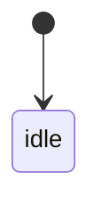

# Plugin UX Improvements Implementation Plan

> **For agentic workers:** REQUIRED SUB-SKILL: Use superpowers:subagent-driven-development (recommended) or superpowers:executing-plans to implement this plan task-by-task. Steps use checkbox (`- [ ]`) syntax for tracking.

**Goal:** The plugin's visible surface — status bar, command names, controls, lifecycle states and the scaffold prompt — is coherent enough to hand to someone who has never used it, and Obsidian can follow a recording the user started with Shorthand's own hotkey.

**Architecture:** Every new rule lands as a pure function in `src/` with its own `bun:test` cover; `main.ts` stays thin Obsidian wiring. This is not stylistic — `node_modules/obsidian` has `"main": ""` and ships types only, so nothing in `main.ts` can be imported under `bun test`, and a rule expressed there is verifiable only by typecheck, the bundle smoke test, and a human. Three new modules carry the work: `src/status-text.ts` (what the status bar says and whether it exists), `src/commands.ts` (the command table as data), `src/panel-model.ts` (what the side panel shows), and `src/follow-policy.ts` (whether an app-started recording is ours to attach to). `src/state.ts` grows a `starting` mode and a counted enhancement depth.

**Tech Stack:** TypeScript 5.9, `bun:test`, esbuild, Obsidian 1.5.7 typings (`minAppVersion: 1.5.0`), `shorthand-core` pinned by GitHub tag.

**Spec:** `docs/superpowers/specs/2026-08-29-plugin-ux-improvements-design.md`

## Global Constraints

- **Branch:** `feat/ux-improvements`, cut from `main`. One branch, one PR, committed task by task.
- **The verification gate, before every push** — there is no CI in this repo, so this is yours to run:
  ```bash
  env -u OBSIDIAN_PLUGIN_DIR npx tsc --noEmit && env -u OBSIDIAN_PLUGIN_DIR npm run build && env -u OBSIDIAN_PLUGIN_DIR npm test
  ```
  `env -u OBSIDIAN_PLUGIN_DIR` is not optional: `AGENTS.md` records that **any build that sees that variable copies straight into a live vault**, from whatever directory it runs in. Build order matters too — `test/plugin-bundle.test.ts` fails when `main.js` is missing or older than its sources, so `npm run build` comes before `npm test`.
- **`main.ts` holds Obsidian wiring only. Rules go in `src/`.** `AGENTS.md` § "The settings surface" is the authority: "Put rules in `src/settings.ts` where they can be tested; keep `main.ts` thin enough that reading it is sufficient review."
- **Settings copy follows `docs/settings-copy-style.md`** — nine rules. Read it before writing any `setName` or `setDesc`. The ones this plan trips over most: one sentence (rule 1), consequence not mechanism (rule 3), positive noun phrase for toggles (rule 5), no generic verbs in naming labels (rule 6), sentence case with periods on descriptions and never on labels (rule 8), second person present tense (rule 9).
- **Command ids never change.** Obsidian keys a user's custom hotkey to `<plugin-id>:<command-id>`; renaming an id silently discards their binding. Only `name` moves.
- **No hardcoded styling.** Obsidian's plugin guidelines forbid it, and `styles.css` says why. New styling goes in `styles.css` using Obsidian's own CSS variables, and `test/plugin-assets.test.ts` must assert any new class.
- **`minAppVersion` stays 1.5.0.** Everything here exists in the 1.5.7 typings; nothing may raise the floor.
- **Strict TypeScript, no `any`. Named exports. `Readonly<{...}>` for settings shapes.** `exactOptionalPropertyTypes` is on, so an optional property takes a conditional spread, never an explicit `undefined`.
- **Comments explain *why* and name the failure they prevent.** Never restate the code; never describe behaviour the code does not implement.
- **Commits use conventional prefixes** (`feat:`, `fix:`, `refactor:`, `docs:`, `test:`, `chore:`) and explain *why*.
- **Stage explicit paths.** Never `git add -A`, `git add .` or `git commit -a`.
- **Task 6 is blocked** until `shorthand-core` `0.15.0` is tagged and pushed. Tasks 1-5 are not — start there.

---

### Task 1: Status bar shows elapsed time and disappears when idle

**Files:**
- Create: `src/status-text.ts`
- Create: `test/status-text.test.ts`
- Modify: `main.ts` — `#renderStatus()` (lines 1124-1141), `onload()`'s status bar creation (line 230)

**Interfaces:**
- Consumes: `PluginUiState` from `src/state.ts` as it exists today.
- Produces:
  ```ts
  export type StatusDisplay =
    | Readonly<{ visible: false }>
    | Readonly<{ visible: true; text: string; tooltip: string }>;

  export type StatusInput = Readonly<{
    state: PluginUiState;
    elapsedMs: number | undefined;
    pendingCharacters: number | undefined;
    minNewChars: number;
  }>;

  export function describeStatus(input: StatusInput): StatusDisplay;
  ```
  Task 3 extends `PluginUiState`; Task 5 reuses the same vocabulary for the panel.

- [ ] **Step 1: Write the failing test**

Create `test/status-text.test.ts`:

```ts
import { describe, expect, test } from "bun:test";
import { describeStatus } from "../src/status-text.js";
import { INITIAL_PLUGIN_STATE, reducePluginState } from "../src/state.js";
import type { PluginUiState } from "../src/state.js";

const capturing: PluginUiState = reducePluginState(INITIAL_PLUGIN_STATE, { type: "capture-started" });

const base = { elapsedMs: undefined, pendingCharacters: undefined, minNewChars: 180 } as const;

describe("describeStatus", () => {
  test("shows nothing at all when idle", () => {
    // The whole point of the change: an idle vault carried "Shorthand: idle · 0/180 chars"
    // permanently, for a plugin that was doing nothing.
    expect(describeStatus({ ...base, state: INITIAL_PLUGIN_STATE })).toEqual({ visible: false });
  });

  test("shows the elapsed clock and nothing else while capturing", () => {
    expect(describeStatus({ ...base, state: capturing, elapsedMs: 754_000 })).toEqual({
      visible: true,
      text: "Shorthand 12:34",
      tooltip: "Capturing. Click to stop.",
    });
  });

  test("keeps the clock while a pass is writing, so the meeting timer never jumps", () => {
    const enhancing = reducePluginState(capturing, { type: "enhancement-started" });
    expect(describeStatus({ ...base, state: enhancing, elapsedMs: 754_000 })).toEqual({
      visible: true,
      text: "Shorthand 12:34 · writing",
      tooltip: "Writing the note. Click to stop the capture.",
    });
  });

  test("reports the character gate in the tooltip, not in the bar", () => {
    // The counter moved off the bar but the reassurance it carried has to survive:
    // a capture sitting below the gate must not look broken.
    const display = describeStatus({
      ...base,
      state: capturing,
      elapsedMs: 60_000,
      pendingCharacters: 140,
    });
    expect(display).toEqual({
      visible: true,
      text: "Shorthand 1:00",
      tooltip: "Capturing. 140 of 180 characters toward the next pass. Click to stop.",
    });
  });

  test("says stopping, because a stop can spend the whole drain budget", () => {
    const stopping = reducePluginState(capturing, { type: "capture-stopping" });
    expect(describeStatus({ ...base, state: stopping, elapsedMs: 754_000 })).toEqual({
      visible: true,
      text: "Shorthand 12:34 · stopping",
      tooltip: "Finishing the capture.",
    });
  });

  test("never shows a mode union member to the user", () => {
    const stopped = reducePluginState(capturing, {
      type: "enhancement-stopped",
      message: "Enhancement stopped after the maximum capture window; capture continues.",
    });
    const display = describeStatus({ ...base, state: stopped, elapsedMs: 60_000 });
    expect(display.visible).toBe(true);
    if (!display.visible) return;
    expect(display.text).not.toContain("enhancement-stopped");
    expect(display.text).toBe("Shorthand 1:00 · enhancement stopped");
    expect(display.tooltip).toBe("Enhancement stopped after the maximum capture window; capture continues.");
  });

  test("stays visible for an error after the capture has ended", () => {
    // An error outlives its capture by design — state.ts has no clear-error event —
    // so hiding on idle must not hide the one state the user needs to see.
    const failed = reducePluginState(INITIAL_PLUGIN_STATE, { type: "error", message: "Shorthand was not running." });
    expect(describeStatus({ ...base, state: failed })).toEqual({
      visible: true,
      text: "Shorthand · error",
      tooltip: "Shorthand was not running.",
    });
  });
});
```

- [ ] **Step 2: Run the test to verify it fails**

```bash
env -u OBSIDIAN_PLUGIN_DIR npx bun test test/status-text.test.ts
```

Expected: FAIL — `Cannot find module '../src/status-text.js'`.

- [ ] **Step 3: Write the implementation**

Create `src/status-text.ts`:

```ts
import { formatElapsed } from "./elapsed.js";
import type { PluginUiState } from "./state.js";

/**
 * What the status bar shows, or that it should not exist at all.
 *
 * `visible: false` is a real outcome rather than an empty string: an Obsidian status
 * bar item that holds "" still occupies its separator and padding, so an idle vault
 * kept a visible gap where the old permanent "Shorthand: idle" used to be.
 */
export type StatusDisplay =
  | Readonly<{ visible: false }>
  | Readonly<{ visible: true; text: string; tooltip: string }>;

export type StatusInput = Readonly<{
  state: PluginUiState;
  /** Milliseconds since the running capture started, or `undefined` when none is. */
  elapsedMs: number | undefined;
  /** Characters banked toward the next enhancement pass, when a runner exists. */
  pendingCharacters: number | undefined;
  minNewChars: number;
}>;

const HIDDEN: StatusDisplay = Object.freeze({ visible: false });

/**
 * The status bar is a clock, not a state readout.
 *
 * Two things were removed and one added. The character counter went to the side panel,
 * which has room to explain it; the raw `PluginMode` token went entirely, because
 * `enhancement-stopped` is a name from this plugin's reducer and no user has seen it.
 * What is left is the elapsed time, which is the one thing a person glances at the
 * status bar for during a meeting.
 */
export function describeStatus(input: StatusInput): StatusDisplay {
  const { state, elapsedMs, pendingCharacters, minNewChars } = input;
  // Idle with nothing to report is the only state that hides. An error survives its
  // capture — `state.ts` deliberately has no clear-error event — so it must still be
  // shown once `captureActive` has gone false, or the plugin would fail silently.
  if (state.mode === "idle") return HIDDEN;

  const clock = elapsedMs === undefined ? "" : ` ${formatElapsed(elapsedMs)}`;
  const gate = pendingCharacters === undefined
    ? ""
    : ` ${pendingCharacters} of ${minNewChars} characters toward the next pass.`;

  switch (state.mode) {
    case "capturing":
      return {
        visible: true,
        text: `Shorthand${clock}`,
        tooltip: `Capturing.${gate} Click to stop.`,
      };
    case "enhancing":
      return {
        visible: true,
        text: `Shorthand${clock} · writing`,
        tooltip: "Writing the note. Click to stop the capture.",
      };
    case "stopping":
      return {
        visible: true,
        text: `Shorthand${clock} · stopping`,
        tooltip: "Finishing the capture.",
      };
    case "enhancement-stopped":
      return {
        visible: true,
        text: `Shorthand${clock} · enhancement stopped`,
        tooltip: state.message ?? "Enhancement stopped; capture continues.",
      };
    case "error":
      return {
        visible: true,
        text: `Shorthand${clock} · error`,
        tooltip: state.message ?? "Shorthand hit an error.",
      };
    default: {
      // A new mode must choose its own words rather than falling through to a
      // union member the user would then be shown.
      const unhandled: never = state.mode;
      throw new Error(`Unhandled plugin mode: ${JSON.stringify(unhandled)}`);
    }
  }
}
```

- [ ] **Step 4: Run the test to verify it passes**

```bash
env -u OBSIDIAN_PLUGIN_DIR npx bun test test/status-text.test.ts
```

Expected: PASS.

- [ ] **Step 5: Wire it into `main.ts`**

Add the import beside the existing `formatElapsed` import:

```ts
import { describeStatus } from "./src/status-text.js";
```

Replace `#renderStatus()` in full:

```ts
  #renderStatus(): void {
    if (this.#statusBar === undefined) return;
    const display = describeStatus({
      state: this.#state,
      elapsedMs: this.#capture === undefined ? undefined : Date.now() - this.#capture.startedAt,
      pendingCharacters: this.#capture?.enhancer?.state.pendingCharacters,
      minNewChars: this.settings.minNewChars,
    });
    // `hide()`/`show()` rather than clearing the text: an item holding "" still
    // occupies its separator, which is the space this change exists to reclaim.
    if (!display.visible) {
      this.#statusBar.hide();
      return;
    }
    this.#statusBar.show();
    this.#statusBar.setText(display.text);
    this.#statusBar.setAttribute("title", display.tooltip);
  }
```

In `onload()`, replace the status bar creation so the item is a click target from the start:

```ts
    this.#statusBar = this.addStatusBarItem();
    // Clickable, and stop-only. The item is hidden while idle (see describeStatus),
    // so there is never a moment where a click could mean "start" — starting lives on
    // the ribbon icon and in the side panel.
    this.#statusBar.addClass("mod-clickable");
    this.registerDomEvent(this.#statusBar, "click", () => {
      if (this.#capture === undefined) return;
      void this.stopCapture().catch((error: unknown) => this.fail(errorMessage(error)));
    });
    this.#renderStatus();
```

- [ ] **Step 6: Run the full gate**

```bash
env -u OBSIDIAN_PLUGIN_DIR npx tsc --noEmit && env -u OBSIDIAN_PLUGIN_DIR npm run build && env -u OBSIDIAN_PLUGIN_DIR npm test
```

Expected: all three PASS.

- [ ] **Step 7: Commit**

```bash
git add src/status-text.ts test/status-text.test.ts main.ts
git commit -m "feat: status bar is a clock, and disappears when idle

An idle vault carried 'Shorthand: idle · 0/180 chars' permanently. The
counter moves to the panel, which can explain it; the mode token goes,
because 'enhancement-stopped' is a name from the reducer."
```

---

### Task 2: Command names match the app's own vocabulary

**Files:**
- Create: `src/commands.ts`
- Create: `test/plugin-commands.test.ts`
- Modify: `main.ts` — the eight `addCommand` calls (lines 245-307)
- Modify: `README.md` — the Commands section

**Interfaces:**
- Consumes: nothing from earlier tasks.
- Produces:
  ```ts
  export type CommandId =
    | "start-capture-this-note" | "start-assisted-notes-capture-this-note"
    | "stop-capture" | "enhance-now" | "clean-up-this-note"
    | "toggle-shorthand-recording" | "toggle-shorthand-assisted-notes"
    | "cancel-shorthand-recording";

  export const COMMAND_NAMES: Readonly<Record<CommandId, string>>;
  ```
  Task 5's panel buttons reuse `COMMAND_NAMES` so a button and its command can never disagree.

- [ ] **Step 1: Write the failing test**

Create `test/plugin-commands.test.ts`:

```ts
import { describe, expect, test } from "bun:test";
import { COMMAND_NAMES, type CommandId } from "../src/commands.js";

describe("command names", () => {
  test("name the two capture modes symmetrically", () => {
    // The asymmetry this fixes: one sibling said which mode it started and the
    // other did not, so the palette read as though there were a default and a
    // special case rather than two peers.
    expect(COMMAND_NAMES["start-capture-this-note"]).toBe("Start meeting capture on this note");
    expect(COMMAND_NAMES["start-assisted-notes-capture-this-note"]).toBe(
      "Start assisted notes capture on this note",
    );
  });

  test("name the two recorder toggles symmetrically", () => {
    expect(COMMAND_NAMES["toggle-shorthand-recording"]).toBe("Toggle Shorthand meeting recording");
    expect(COMMAND_NAMES["toggle-shorthand-assisted-notes"]).toBe(
      "Toggle Shorthand assisted notes recording",
    );
  });

  test("use the app's own spelling of the modes", () => {
    // shorthand-app/src/shorthand/locales/en.json is authoritative:
    //   "settings.modes.tabs.meetings": "Meetings"
    //   "settings.modes.tabs.assistedNotes": "Assisted notes"
    // Sentence case, lowercase "notes". Not "Meeting Notes" / "Assisted Notes".
    for (const name of Object.values(COMMAND_NAMES)) {
      expect(name).not.toContain("Assisted Notes");
      expect(name).not.toContain("Meeting Notes");
    }
  });

  test("are sentence case and carry no plugin prefix", () => {
    // Obsidian renders these as "Shorthand: <name>", so a prefix here produced
    // "Shorthand: Shorthand: start capture…". Its guidelines also require
    // sentence case for all UI text.
    for (const name of Object.values(COMMAND_NAMES)) {
      expect(name.startsWith("Shorthand:")).toBe(false);
      expect(name[0]).toBe(name[0]?.toUpperCase());
      expect(name.endsWith(".")).toBe(false);
    }
  });

  test("cover every id exactly once", () => {
    const ids: CommandId[] = [
      "start-capture-this-note",
      "start-assisted-notes-capture-this-note",
      "stop-capture",
      "enhance-now",
      "clean-up-this-note",
      "toggle-shorthand-recording",
      "toggle-shorthand-assisted-notes",
      "cancel-shorthand-recording",
    ];
    expect(Object.keys(COMMAND_NAMES).sort()).toEqual([...ids].sort());
    expect(new Set(Object.values(COMMAND_NAMES)).size).toBe(ids.length);
  });
});
```

- [ ] **Step 2: Run the test to verify it fails**

```bash
env -u OBSIDIAN_PLUGIN_DIR npx bun test test/plugin-commands.test.ts
```

Expected: FAIL — `Cannot find module '../src/commands.js'`.

- [ ] **Step 3: Write the implementation**

Create `src/commands.ts`:

```ts
/**
 * Every command this plugin registers, as data rather than as eight string literals
 * scattered through `main.ts`.
 *
 * It is here and not there for the reason `AGENTS.md` gives for the settings surface:
 * `node_modules/obsidian` ships types only, so nothing in `main.ts` can be imported
 * under `bun test`. A name written inline there is verifiable only by a human reading
 * it, which is how the two capture commands came to be named asymmetrically.
 */

export type CommandId =
  | "start-capture-this-note"
  | "start-assisted-notes-capture-this-note"
  | "stop-capture"
  | "enhance-now"
  | "clean-up-this-note"
  | "toggle-shorthand-recording"
  | "toggle-shorthand-assisted-notes"
  | "cancel-shorthand-recording";

/**
 * The ids are frozen. Obsidian keys a user's custom hotkey to
 * `<plugin-id>:<command-id>`, so renaming one silently discards their binding with
 * nothing to say it happened. `start-capture-this-note` therefore keeps a name that
 * no longer describes it, and that is the correct trade.
 *
 * The spellings of the modes come from the app's own settings pane
 * (`shorthand-app/src/shorthand/locales/en.json`: "Meetings", "Assisted notes"), not
 * from this repository's guesses. Sentence case throughout, per Obsidian's plugin
 * guidelines, and no "Shorthand:" prefix — the palette adds one.
 *
 * The three recorder commands do name Shorthand, because they drive the external app
 * rather than this plugin. That exception is recorded in `docs/settings-copy-style.md`
 * under "Obsidian's other binding rules".
 */
export const COMMAND_NAMES: Readonly<Record<CommandId, string>> = Object.freeze({
  "start-capture-this-note": "Start meeting capture on this note",
  "start-assisted-notes-capture-this-note": "Start assisted notes capture on this note",
  "stop-capture": "Stop capture",
  "enhance-now": "Enhance now",
  "clean-up-this-note": "Clean up this note",
  "toggle-shorthand-recording": "Toggle Shorthand meeting recording",
  "toggle-shorthand-assisted-notes": "Toggle Shorthand assisted notes recording",
  "cancel-shorthand-recording": "Cancel Shorthand recording",
});
```

- [ ] **Step 4: Run the test to verify it passes**

```bash
env -u OBSIDIAN_PLUGIN_DIR npx bun test test/plugin-commands.test.ts
```

Expected: PASS.

- [ ] **Step 5: Wire it into `main.ts`**

Add the import:

```ts
import { COMMAND_NAMES } from "./src/commands.js";
```

Then change each of the eight `addCommand` calls to take its name from the table. The `id` and the callback of each stay exactly as they are. For example:

```ts
    this.addCommand({
      id: "start-capture-this-note",
      name: COMMAND_NAMES["start-capture-this-note"],
      checkCallback: (checking: boolean) => {
        if (!this.hasActiveMarkdownFile()) return false;
        if (checking) return true;
        void this.startCaptureOnActiveNote();
        return true;
      },
    });
```

Do the same for the other seven. Update the comment block above the first `addCommand` (lines 240-244), which currently explains the no-prefix and sentence-case rules with a worked example — keep both facts, and add that the strings now live in `src/commands.ts` so they can be tested:

```ts
    // Names come from src/commands.ts so they are covered by bun test; main.ts cannot
    // be imported under it. They carry no plugin prefix and are sentence case, per
    // Obsidian's plugin guidelines: the palette already renders these as "Shorthand:
    // Start meeting capture on this note". Spelling it out here produced "Shorthand:
    // Shorthand: start capture…".
    // checkCallback, not callback: Obsidian hides a command whose check returns false,
    // which is its prescribed way to express "needs an open Markdown note". The check
    // runs on every palette render, so it must not fire a Notice — hence
    // hasActiveMarkdownFile rather than activeMarkdownFile.
```

- [ ] **Step 6: Update the README**

In `README.md`, replace the Commands list with the new names:

```markdown
- **Start meeting capture on this note**
- **Start assisted notes capture on this note**
- **Stop capture**
- **Enhance now**
- **Clean up this note**
- **Toggle Shorthand meeting recording**
- **Toggle Shorthand assisted notes recording**
- **Cancel Shorthand recording**
```

Then check the rest of `README.md` for the old names and fix each. At minimum: the "Start a meeting" section says *Shorthand: Start capture on this note* and must become *Shorthand: Start meeting capture on this note*. Search for stragglers:

```bash
grep -rn "Start capture\|Toggle Shorthand recording\|Toggle Shorthand assisted notes" README.md main.ts src/
```

`main.ts`'s `START_NOT_RUNNING` (line 199) builds a recovery notice naming one of the two toggle commands by literal string. Both literals are now wrong. Change it to read from the table:

```ts
const START_NOT_RUNNING = (signal: ControlSignal): string =>
  `Shorthand was not running, so this capture did not start a recording; Shorthand is starting now. Once it is up, start the recording with Shorthand's shortcut or "${
    signal === "toggle-assisted-notes"
      ? COMMAND_NAMES["toggle-shorthand-assisted-notes"]
      : COMMAND_NAMES["toggle-shorthand-recording"]
  }" — the capture is already running and will pick it up.`;
```

`src/enhance-mode.ts` has an `enhanceCommandName` function that names the two enhancement commands for the same reason. Read it, and if it holds its own literals, point it at `COMMAND_NAMES` too rather than leaving a second source.

- [ ] **Step 7: Run the full gate**

```bash
env -u OBSIDIAN_PLUGIN_DIR npx tsc --noEmit && env -u OBSIDIAN_PLUGIN_DIR npm run build && env -u OBSIDIAN_PLUGIN_DIR npm test
```

Expected: all three PASS. `test/plugin-enhance-mode.test.ts` may fail if `enhanceCommandName`'s strings moved — update its expectations to the new names.

- [ ] **Step 8: Commit**

```bash
git add src/commands.ts test/plugin-commands.test.ts src/enhance-mode.ts test/plugin-enhance-mode.test.ts main.ts README.md
git commit -m "feat: name commands after the app's own modes, symmetrically

One sibling said which mode it started and the other did not. The
spellings now come from the app's settings pane rather than this repo's
guess, and the table is in src/ so a name can be tested."
```

---

### Task 3: One capture state machine, with no stranding states

**Files:**
- Modify: `src/state.ts`
- Modify: `test/plugin-state.test.ts`
- Create: `docs/capture-states.md`
- Create: `test/capture-states-doc.test.ts`
- Modify: `main.ts` — `startCaptureOnActiveNote()` (begins at line 324; its guard is at 327-330 and `#capture` is assigned at 447), the Assisted Notes acknowledgement callback (533-545), `reportOutcome` (1015-1022), `abortAssistedNotesStart()` (begins at 644)

**Do Step 0 first.** This task introduces a counter over events that are currently
dispatched twice per pass. Introducing the count before removing the duplication
ships a worse bug than the one being fixed.

**Interfaces:**
- Consumes: `describeStatus` from Task 1, which must keep compiling as `PluginMode` grows.
- Produces:
  - `PluginMode` gains `"starting"`.
  - `PluginUiState` gains `enhancementDepth: number` and drops nothing.
  - `PluginUiEvent` gains `{ type: "capture-starting" }` and `{ type: "capture-start-failed" }`.
  - `export const STATE_TRANSITIONS: readonly Readonly<{ from: PluginMode; event: PluginUiEvent["type"]; to: PluginMode }>[]` — the table `docs/capture-states.md` is checked against.

- [ ] **Step 0: Make each pass report its end exactly once**

Core emits a `finished` status and *then* returns a completed outcome (`shorthand-core/src/agent/runner.ts:503-506`). The plugin dispatches `enhancement-finished` twice for that one pass — once at `main.ts:964-966`, once at `main.ts:1016-1018` — and `enhancement-stopped` twice for an expiry, at `main.ts:967-976` and `main.ts:1019-1022`.

Under today's boolean the second dispatch is a harmless no-op. Under the count this task introduces, it is a double-decrement that returns the UI to `capturing` while another pass is still writing. Remove the duplication first.

**`onEnhanceStatus` is the single owner.** It sees every pass, including the automatic live ticks that never reach `reportOutcome` at all. `reportOutcome` sees only the four call sites that await a pass directly, so it cannot be the owner — it would miss every live tick.

In `reportOutcome`, drop the two lifecycle dispatches and keep everything else. The `completed` branch becomes:

```ts
    if (outcome.status === "completed") {
      // No `enhancement-finished` here: core emitted a `finished` status before
      // returning this outcome, and `onEnhanceStatus` already dispatched for it.
      // Both firing double-decrements the pass counter, which ends the `enhancing`
      // state while a second, overlapping pass is still writing.
      new Notice(outcome.written ? "Shorthand updated the AI block." : "The AI block was already up to date.");
    } else if (outcome.status === "expired") {
      // Same reason: `onEnhanceStatus`'s `expired` arm owns the dispatch and the Notice.
    } else if (outcome.status === "requeued") {
```

The `expired` branch's `Notice` also duplicates `onEnhanceStatus`'s (`main.ts:970-975` shows the same message and the same 8-second duration), so the branch collapses to nothing and the whole `else if` goes. Confirm that by reading both arms before deleting.

Leave the `requeued`, `failed` and `timed-out` branches alone: none of them has a counterpart in `onEnhanceStatus`'s switch.

Run the suite to confirm nothing depended on the removed dispatches:

```bash
env -u OBSIDIAN_PLUGIN_DIR npm test
```

Expected: PASS.

- [ ] **Step 1: Write the failing tests**

Add to `test/plugin-state.test.ts`:

```ts
  test("a start is refused while another start is still in flight", () => {
    // The bug this closes: startCaptureOnActiveNote guarded on `#capture !== undefined`,
    // which is assigned only after marker preflight, a possible modal, frontmatter
    // writes, sidecar setup and createEnhancer. Two invocations inside that window both
    // passed the guard and both built a runtime; the second assignment orphaned the
    // first, leaving a live follower child, a control and an enhancer nothing would ever
    // dispose, and a Shorthand recording still running.
    const starting = reducePluginState(INITIAL_PLUGIN_STATE, { type: "capture-starting" });
    expect(starting.mode).toBe("starting");
    expect(canStartCapture(starting)).toBe(false);
    expect(canStartCapture(INITIAL_PLUGIN_STATE)).toBe(true);
  });

  test("a start that never became a capture returns to idle, not to stopped", () => {
    // Assisted Notes' start acknowledgement can time out after the runtime exists.
    // Reporting that as a stopped capture tells the user something ran when nothing did.
    const starting = reducePluginState(INITIAL_PLUGIN_STATE, { type: "capture-starting" });
    const failed = reducePluginState(starting, { type: "capture-start-failed" });
    expect(failed).toEqual({ mode: "idle", captureActive: false, stopping: false, enhancementDepth: 0 });
  });

  test("capturing is only claimed once the capture actually exists", () => {
    const starting = reducePluginState(INITIAL_PLUGIN_STATE, { type: "capture-starting" });
    expect(starting.captureActive).toBe(false);
    const started = reducePluginState(starting, { type: "capture-started" });
    expect(started).toEqual({ mode: "capturing", captureActive: true, stopping: false, enhancementDepth: 0 });
  });

  test("counts overlapping enhancement passes instead of toggling", () => {
    // "Enhance now" on a second note while a capture runs on the first builds an
    // independent EnhanceRunner. Both report here. With a boolean sense of "enhancing",
    // whichever finished first ended the state while the other was still writing.
    const capturing = reducePluginState(INITIAL_PLUGIN_STATE, { type: "capture-started" });
    const one = reducePluginState(capturing, { type: "enhancement-started" });
    const two = reducePluginState(one, { type: "enhancement-started" });
    expect(two.enhancementDepth).toBe(2);
    const stillWriting = reducePluginState(two, { type: "enhancement-finished" });
    expect(stillWriting.mode).toBe("enhancing");
    const done = reducePluginState(stillWriting, { type: "enhancement-finished" });
    expect(done.mode).toBe("capturing");
    expect(done.enhancementDepth).toBe(0);
  });

  test("the depth floors at zero, so an unpaired finish cannot strand it negative", () => {
    const capturing = reducePluginState(INITIAL_PLUGIN_STATE, { type: "capture-started" });
    const done = reducePluginState(capturing, { type: "enhancement-finished" });
    expect(done.enhancementDepth).toBe(0);
    expect(done.mode).toBe("capturing");
  });

  test("a stopped enhancement releases its own slot", () => {
    const capturing = reducePluginState(INITIAL_PLUGIN_STATE, { type: "capture-started" });
    const one = reducePluginState(capturing, { type: "enhancement-started" });
    const stopped = reducePluginState(one, { type: "enhancement-stopped", message: "out of time" });
    expect(stopped.enhancementDepth).toBe(0);
    expect(stopped.mode).toBe("enhancement-stopped");
  });

  // Two directions, and the second is the one that matters. Checking only that each
  // listed row is reachable lets an unlisted transition — `capture-started` straight
  // from idle, `error` from anywhere — pass vacuously by simply never being written
  // down, which is exactly the drift the diagram exists to prevent.
  test("every listed transition is what the reducer actually does", () => {
    for (const { from, event, to } of STATE_TRANSITIONS) {
      const next = reducePluginState(stateInMode(from), eventOfType(event));
      expect({ from, event, to: next.mode }).toEqual({ from, event, to });
    }
  });

  test("the table lists every mode-changing transition the reducer can make", () => {
    const listed = new Set(STATE_TRANSITIONS.map(({ from, event }) => `${from}|${event}`));
    const missing: string[] = [];
    for (const from of ALL_MODES) {
      for (const event of ALL_EVENT_TYPES) {
        const before = stateInMode(from);
        const after = reducePluginState(before, eventOfType(event));
        // Self-transitions that change nothing observable are not edges worth drawing.
        if (after.mode === before.mode && after.message === before.message) continue;
        if (!listed.has(`${from}|${event}`)) missing.push(`${from} --${event}--> ${after.mode}`);
      }
    }
    expect(missing).toEqual([]);
  });
```

Add these helpers at the top of the same file, below the imports. `ALL_MODES` and `ALL_EVENT_TYPES` are written out by hand *here* rather than derived from the source, deliberately: a list derived from `STATE_TRANSITIONS` would grow whenever the table grew and could never report an omission, which is the entire failure the second test exists to catch. Adding a mode or an event means adding it here, and the `never` checks make forgetting a compile error:

```ts
const ALL_MODES = [
  "idle", "starting", "capturing", "stopping", "enhancing", "enhancement-stopped", "error",
] as const satisfies readonly PluginMode[];

const ALL_EVENT_TYPES = [
  "capture-starting", "capture-start-failed", "capture-started", "capture-stopping",
  "capture-stopped", "enhancement-started", "enhancement-finished", "enhancement-stopped", "error",
] as const satisfies readonly PluginUiEvent["type"][];

/** A state parked in `mode`, built only through the reducer so it is always reachable. */
function stateInMode(mode: PluginMode): PluginUiState {
  switch (mode) {
    case "idle":
      return INITIAL_PLUGIN_STATE;
    case "starting":
      return reducePluginState(INITIAL_PLUGIN_STATE, { type: "capture-starting" });
    case "capturing":
      return reducePluginState(stateInMode("starting"), { type: "capture-started" });
    case "stopping":
      return reducePluginState(stateInMode("capturing"), { type: "capture-stopping" });
    case "enhancing":
      return reducePluginState(stateInMode("capturing"), { type: "enhancement-started" });
    case "enhancement-stopped":
      return reducePluginState(stateInMode("enhancing"), { type: "enhancement-stopped", message: "out of time" });
    case "error":
      return reducePluginState(stateInMode("capturing"), { type: "error", message: "boom" });
  }
}

/** A representative event of each type, for driving the transition table. */
function eventOfType(type: PluginUiEvent["type"]): PluginUiEvent {
  switch (type) {
    case "enhancement-stopped":
      return { type, message: "out of time" };
    case "error":
      return { type, message: "boom" };
    default:
      return { type };
  }
}
```

Update the file's imports to bring in `STATE_TRANSITIONS`, `canStartCapture`, `type PluginMode` and `type PluginUiEvent` alongside what it already imports.

- [ ] **Step 2: Run the tests to verify they fail**

```bash
env -u OBSIDIAN_PLUGIN_DIR npx bun test test/plugin-state.test.ts
```

Expected: FAIL — `canStartCapture` and `STATE_TRANSITIONS` are not exported, and `"capture-starting"` is not an event type.

- [ ] **Step 3: Write the implementation**

Rewrite `src/state.ts`. Keep every existing comment that still tells the truth — the ones on `stopping` and on the absence of a clear-error event are load-bearing and must survive verbatim.

```ts
export type PluginMode =
  | "idle"
  | "starting"
  | "capturing"
  | "stopping"
  | "enhancing"
  | "enhancement-stopped"
  | "error";

export type PluginUiState = Readonly<{
  mode: PluginMode;
  captureActive: boolean;
  /**
   * Set between the stop request and the capture actually finishing. Stopping is not
   * instant — it can spend a control timeout plus the full drain budget waiting for
   * Shorthand's `final` — and without this the status bar still read "capturing" for the whole
   * of it, which looks like a hang. Kept as its own flag rather than only a mode because
   * the final enhancement pass runs inside that window and must return to "stopping", not
   * back to "capturing".
   */
  stopping: boolean;
  /**
   * How many enhancement passes are running, not whether one is.
   *
   * "Enhance now" on a note the capture does not own builds its own `EnhanceRunner`, so two
   * passes can be in flight at once and both report here. A boolean let whichever finished
   * first end the state while the other was still writing into a note.
   */
  enhancementDepth: number;
  message?: string;
}>;

export type PluginUiEvent =
  /**
   * Dispatched synchronously, as the first statement of `startCaptureOnActiveNote`, before
   * any await. That is the whole point of it: the runtime it announces does not exist for
   * some time yet — marker preflight, a possible confirmation modal, frontmatter writes,
   * sidecar setup and `createEnhancer` all run first — and the guard that used to protect
   * that window tested `#capture`, which is assigned at the end of it.
   */
  | Readonly<{ type: "capture-starting" }>
  /** The start sequence gave up before a capture existed. Distinct from a capture stopping. */
  | Readonly<{ type: "capture-start-failed" }>
  | Readonly<{ type: "capture-started" }>
  | Readonly<{ type: "capture-stopping" }>
  | Readonly<{ type: "capture-stopped" }>
  | Readonly<{ type: "enhancement-started" }>
  | Readonly<{ type: "enhancement-finished" }>
  | Readonly<{ type: "enhancement-stopped"; message: string }>
  // There is deliberately no "clear-error": an error stays visible until the work that
  // could have fixed it succeeds (a completed enhancement pass) or a new capture starts.
  // A dismiss event existed and was never dispatched, so it only made the status bar's
  // stickiness look accidental.
  | Readonly<{ type: "error"; message: string }>;

export const INITIAL_PLUGIN_STATE: PluginUiState = Object.freeze({
  mode: "idle",
  captureActive: false,
  stopping: false,
  enhancementDepth: 0,
});

/**
 * Whether a start command may proceed.
 *
 * The predicate is here rather than in `main.ts` so it can be tested: `main.ts` cannot be
 * imported under `bun test`, which is exactly why the old asynchronous guard survived
 * review. `starting` is the state this exists for.
 */
export function canStartCapture(state: PluginUiState): boolean {
  // Deliberately not "mode === idle". `error` and `enhancement-stopped` are sticky by
  // design and outlive the capture that raised them, so gating on the mode alone would
  // make one failed capture refuse every start until Obsidian restarted. What actually
  // blocks a start is another start or capture being in flight.
  return state.mode !== "starting"
    && state.mode !== "capturing"
    && state.mode !== "stopping"
    && !state.captureActive
    && !state.stopping;
}

export function reducePluginState(state: PluginUiState, event: PluginUiEvent): PluginUiState {
  switch (event.type) {
    case "capture-starting":
      return { mode: "starting", captureActive: false, stopping: false, enhancementDepth: 0 };
    case "capture-start-failed":
      // Only `starting` returns to idle. A setup failure calls `fail()` first, which
      // dispatches a sticky `error` carrying the message the user needs; clearing that
      // to idle on the way out would blank the status bar on the one path where
      // something actually went wrong. From any other mode this just releases the start.
      return state.mode === "starting"
        ? { mode: "idle", captureActive: false, stopping: false, enhancementDepth: 0 }
        : { ...state, captureActive: false, stopping: false };
    case "capture-started":
      return { mode: "capturing", captureActive: true, stopping: false, enhancementDepth: 0 };
    case "capture-stopping":
      return state.mode === "error" || state.mode === "enhancement-stopped"
        ? { ...state, stopping: true }
        : {
          mode: "stopping",
          captureActive: state.captureActive,
          stopping: true,
          enhancementDepth: state.enhancementDepth,
        };
    case "capture-stopped":
      return state.mode === "error" || state.mode === "enhancement-stopped"
        ? { ...state, captureActive: false, stopping: false }
        : { mode: "idle", captureActive: false, stopping: false, enhancementDepth: 0 };
    case "enhancement-started":
      return {
        mode: "enhancing",
        captureActive: state.captureActive,
        stopping: state.stopping,
        enhancementDepth: state.enhancementDepth + 1,
      };
    case "enhancement-finished": {
      // Floored at zero rather than trusted: `reportOutcome` and `onEnhanceStatus` both
      // dispatch "finished", so a single pass can report twice, and a negative depth would
      // strand the mode in `enhancing` for the rest of the session.
      const depth = Math.max(0, state.enhancementDepth - 1);
      return {
        mode: depth > 0 ? "enhancing" : restingMode(state),
        captureActive: state.captureActive,
        stopping: state.stopping,
        enhancementDepth: depth,
      };
    }
    case "enhancement-stopped":
      return {
        mode: "enhancement-stopped",
        captureActive: state.captureActive,
        stopping: state.stopping,
        // The pass that stopped released its slot; it is not still running.
        enhancementDepth: Math.max(0, state.enhancementDepth - 1),
        message: event.message,
      };
    case "error":
      return {
        mode: "error",
        captureActive: state.captureActive,
        stopping: state.stopping,
        enhancementDepth: state.enhancementDepth,
        message: event.message,
      };
  }
}

/** Where the status returns to once a transient mode ends. */
function restingMode(state: PluginUiState): PluginMode {
  if (state.stopping) return "stopping";
  return state.captureActive ? "capturing" : "idle";
}

/**
 * Every transition the reducer can make, as data.
 *
 * It exists so `docs/capture-states.md` can be checked against the code rather than
 * maintained beside it. A hand-drawn diagram of a state machine is wrong within two
 * changes; a test that regenerates it is not.
 */
export const STATE_TRANSITIONS: readonly Readonly<{
  from: PluginMode;
  event: PluginUiEvent["type"];
  to: PluginMode;
}>[] = Object.freeze([
  { from: "idle", event: "capture-starting", to: "starting" },
  // Reachable, and listed rather than quietly omitted: `capture-started` does not
  // require a preceding `capture-starting`, and a table that only drew the happy
  // path would let that go unnoticed.
  { from: "idle", event: "capture-started", to: "capturing" },
  { from: "idle", event: "enhancement-started", to: "enhancing" },
  { from: "idle", event: "error", to: "error" },
  { from: "starting", event: "capture-started", to: "capturing" },
  { from: "starting", event: "capture-start-failed", to: "idle" },
  { from: "starting", event: "capture-stopping", to: "stopping" },
  { from: "starting", event: "enhancement-started", to: "enhancing" },
  { from: "starting", event: "error", to: "error" },
  { from: "capturing", event: "capture-stopping", to: "stopping" },
  { from: "capturing", event: "capture-stopped", to: "idle" },
  { from: "capturing", event: "capture-starting", to: "starting" },
  { from: "capturing", event: "enhancement-started", to: "enhancing" },
  { from: "capturing", event: "error", to: "error" },
  { from: "stopping", event: "capture-stopped", to: "idle" },
  { from: "stopping", event: "capture-starting", to: "starting" },
  { from: "stopping", event: "capture-started", to: "capturing" },
  { from: "stopping", event: "enhancement-started", to: "enhancing" },
  { from: "stopping", event: "error", to: "error" },
  { from: "enhancing", event: "enhancement-finished", to: "capturing" },
  { from: "enhancing", event: "enhancement-stopped", to: "enhancement-stopped" },
  { from: "enhancing", event: "capture-starting", to: "starting" },
  { from: "enhancing", event: "capture-started", to: "capturing" },
  { from: "enhancing", event: "capture-stopping", to: "stopping" },
  { from: "enhancing", event: "capture-stopped", to: "idle" },
  { from: "enhancing", event: "error", to: "error" },
  { from: "enhancement-stopped", event: "capture-starting", to: "starting" },
  { from: "enhancement-stopped", event: "capture-started", to: "capturing" },
  { from: "enhancement-stopped", event: "enhancement-started", to: "enhancing" },
  { from: "enhancement-stopped", event: "error", to: "error" },
  { from: "error", event: "capture-starting", to: "starting" },
  { from: "error", event: "capture-started", to: "capturing" },
  { from: "error", event: "enhancement-started", to: "enhancing" },
]);
```

**This table is a first draft written from reading the reducer, not from running it.** Do not trust it. The two tests in Step 1 are the authority in both directions: one asserts every listed row is what the reducer does, the other asserts the reducer has no mode-changing transition the table omits. Run them, then correct the table until both pass.

Correct the *table*, not the reducer — the reducer's behaviour here is deliberate and its comments say why. The one thing to look at twice is the stickiness of `error` and `enhancement-stopped` under `capture-stopped`: both keep their mode and change only their flags, so under the second test's "changed nothing observable" rule they may or may not count as edges depending on what `capture-stopped` does to `captureActive`. Let the test tell you.

- [ ] **Step 4: Run the tests to verify they pass**

```bash
env -u OBSIDIAN_PLUGIN_DIR npx bun test test/plugin-state.test.ts
```

Expected: PASS. If a `STATE_TRANSITIONS` row fails, the reducer is the authority — correct the row.

- [ ] **Step 5: Write the diagram and the test that keeps it honest**

Create `docs/capture-states.md`:

````markdown
---
title: Capture states
---

# Capture states

The plugin's capture lifecycle, as `src/state.ts` implements it.

**This diagram is generated from `STATE_TRANSITIONS`.** Do not edit the Mermaid
block by hand — `test/capture-states-doc.test.ts` checks it against the reducer's
own table in both directions and fails when the two disagree. A hand-maintained
diagram of a state machine is wrong within two changes.

<!-- GENERATED: paste the output of the command below. -->


## What each state means to a user

| State | The status bar says | What is happening |
| --- | --- | --- |
| `idle` | nothing — the item is hidden | No capture. |
| `starting` | `Shorthand · starting` | A start command is running its setup. No follower is attached yet, and a second start is refused. |
| `capturing` | `Shorthand 12:34` | A follower is attached and the transcript is arriving. |
| `enhancing` | `Shorthand 12:34 · writing` | One or more enhancement passes are writing the note. |
| `stopping` | `Shorthand 12:34 · stopping` | The stop was requested. It can spend a control timeout plus the whole drain budget. |
| `enhancement-stopped` | `Shorthand 12:34 · enhancement stopped` | Enhancement is off for the rest of this capture. Capture continues. |
| `error` | `Shorthand · error` | Something failed. Sticky by design: it clears when an enhancement pass succeeds or a new capture starts, never on its own. |

## Three things the shape is defending

**`starting` exists because the old guard was asynchronous.** `startCaptureOnActiveNote`
tested `#capture !== undefined`, and `#capture` is assigned at the *end* of the
setup — after marker preflight, a possible confirmation modal, frontmatter writes,
sidecar setup and `createEnhancer`. Two starts inside that window both passed, both
built a runtime, and the second orphaned the first: a live follower child, a control
and an enhancer that nothing would ever dispose, and a Shorthand recording left
running. `capture-starting` is dispatched synchronously before the first await, so
the guard now covers the whole window.

**`capture-start-failed` is not `capture-stopped`.** Assisted Notes waits up to three
seconds for Shorthand to acknowledge the recording it asked for, and may never get it.
Walking that back as a stopped capture would tell the user a capture had run when none
ever did.

**`enhancementDepth` is a count, not a flag.** "Enhance now" on a note the capture
does not own builds a second `EnhanceRunner`, and both report into this reducer.
Whichever finished first used to end the state while the other was still writing.
````

Do not hand-write the edges. Generate them from the table you settled on in Step 3,
after its tests pass, and paste the output under the `[*] --> idle` line:

```bash
env -u OBSIDIAN_PLUGIN_DIR npx bun -e 'const {STATE_TRANSITIONS}=await import("./src/state.ts");for(const t of STATE_TRANSITIONS)console.log(`    ${t.from} --> ${t.to}: ${t.event}`)'
```

Then create `test/capture-states-doc.test.ts`:

```ts
import { describe, expect, test } from "bun:test";
import { readFileSync } from "node:fs";
import { resolve } from "node:path";
import { STATE_TRANSITIONS } from "../src/state.js";

/**
 * The diagram in docs/capture-states.md is documentation of a state machine, which is
 * the kind of documentation that rots fastest and most invisibly: nothing fails when a
 * transition is added and the picture is not. So it is generated here and compared,
 * rather than trusted.
 */
describe("the capture state diagram", () => {
  test("matches the reducer's own transition table", () => {
    const doc = readFileSync(resolve(process.cwd(), "docs/capture-states.md"), "utf8");
    const expected = STATE_TRANSITIONS.map(({ from, event, to }) => `    ${from} --> ${to}: ${event}`);
    for (const line of expected) {
      expect(doc).toContain(line);
    }
  });

  test("draws no transition the reducer cannot make", () => {
    const doc = readFileSync(resolve(process.cwd(), "docs/capture-states.md"), "utf8");
    const drawn = [...doc.matchAll(/^ {4}(\S+) --> (\S+): (\S+)$/gm)].map((match) => `${match[1]}|${match[3]}|${match[2]}`);
    const real = new Set(STATE_TRANSITIONS.map(({ from, event, to }) => `${from}|${event}|${to}`));
    for (const edge of drawn) {
      expect(real.has(edge)).toBe(true);
    }
  });
});
```

- [ ] **Step 6: Close the start guard in `main.ts`**

Three separate changes, and the second and third are what make the first worth anything.

**6a — the guard itself.** `startCaptureOnActiveNote` begins at `main.ts:324` and its guard is at `327-330`. Replace that guard:

```ts
  async startCaptureOnActiveNote(
    recordingSignal: ControlSignal = "toggle-transcription",
  ): Promise<void> {
    // Synchronous, before any await. The guard this replaces tested `#capture`, which is
    // assigned at main.ts:447 — so two starts fired inside the setup window both passed it,
    // and the second orphaned the first's follower, control and enhancer.
    if (!canStartCapture(this.#state)) {
      new Notice("Shorthand is already capturing. Stop it before starting another note.");
      return;
    }
    this.dispatch({ type: "capture-starting" });
```

**6b — release `starting` on every exit that never reached a capture.** There are nine early `return`s between the dispatch and `this.dispatch({ type: "capture-started" })` at `main.ts:449`, plus the `catch`. Count them yourself; that number is from 2026-08-29 and this task is the reason it will change. Do not add a dispatch to each — that is a list that goes stale. Wrap the body:

```ts
    let handedOff = false;
    try {
      // ... the entire existing body, unchanged, including its own try/catch ...
    } finally {
      // Any path that left without handing ownership to a live runtime has to release
      // `starting`, or the plugin refuses every later start with "already capturing".
      // `capture-start-failed` returns to idle only from `starting`, so a setup error
      // that already dispatched a sticky `error` keeps its message.
      if (!handedOff) this.dispatch({ type: "capture-start-failed" });
    }
```

`handedOff` means "something else now owns this runtime's lifecycle", which is **not** the same as "a capture started". Set it immediately after `this.#capture = runtime` (`main.ts:447`), before the `capture-started` dispatch — from that assignment onwards, `finishRuntime`, `forceStopCapture`, `captureSettled` and `abortAssistedNotesStart` are all reachable and each dispatches its own terminal event. A `finally` firing after that point would fight them.

**6c — Assisted Notes must stop claiming "capturing" before it is.** This is the half that actually fixes the spec's problem 3, and without it the `starting` mode is decoration.

Today `main.ts:448-449` dispatches `capture-started` for both modes at the moment the runtime is assigned. For Assisted Notes that is up to `START_ACKNOWLEDGEMENT_MS` (3s) before anyone knows a recording exists, and it may never exist — `recorder.start()` resolves `"not-started"` (`recorder.ts:445-466`) and `abortAssistedNotesStart` walks it back.

So make the dispatch conditional on the mode, matching the split that already exists at `main.ts:521-545`:

```ts
      this.#capture = runtime;
      handedOff = true;
      unownedEnhancer = undefined;
      // Meeting is fire-and-forget: a sent toggle is proof enough, so it goes straight to
      // capturing. Assisted Notes waits — see the acknowledgement branch below, and
      // START_ACKNOWLEDGEMENT_MS for why a sent toggle is not proof there.
      if (recordingSignal !== "toggle-assisted-notes" || recorder === undefined) {
        this.dispatch({ type: "capture-started" });
      }
```

Then, in the Assisted Notes acknowledgement callback at `main.ts:533-545`, dispatch on the outcome:

```ts
        void recorder.start(attached).then(async (outcome) => {
          if (outcome === "started") {
            this.dispatch({ type: "capture-started" });
            new Notice(`Shorthand capture started: ${file.path}`);
            return;
          }
          if (outcome === "stopped") {
            // A concurrent stop/quit already owns its own notices and teardown.
            return;
          }
          const reason = recorder.startFailure;
          if (reason !== undefined) new Notice(ASSISTED_NOTES_START_FAILURE_NOTICES[reason], 10_000);
          await this.abortAssistedNotesStart(runtime);
        });
```

And in `abortAssistedNotesStart` (begins at `main.ts:644`), the terminal dispatch changes, because nothing here ever became a capture — its own doc comment already says so:

```ts
    if (this.#capture === runtime) this.#capture = undefined;
    // Not `capture-stopped`: this path exists precisely because no recording ever
    // started, and reporting a stopped capture tells the user something ran.
    this.dispatch({ type: "capture-start-failed" });
```

Note the consequence and accept it: while Assisted Notes waits for its acknowledgement, `#capture` is set but the mode is `starting`. `canStartCapture` refuses a second start throughout, which is correct, and the status bar says "starting" rather than lying about a capture. The panel's Stop button is driven by `state.captureActive`, so it stays disabled during that window — also correct, since there is nothing yet to stop.

- [ ] **Step 7: Run the full gate**

```bash
env -u OBSIDIAN_PLUGIN_DIR npx tsc --noEmit && env -u OBSIDIAN_PLUGIN_DIR npm run build && env -u OBSIDIAN_PLUGIN_DIR npm test
```

Expected: all three PASS. `describeStatus` will fail to compile until its `switch` handles `"starting"` — add the arm:

```ts
    case "starting":
      return { visible: true, text: "Shorthand · starting", tooltip: "Starting the capture." };
```

and add a matching case to `test/status-text.test.ts`.

- [ ] **Step 8: Verify by hand in Obsidian**

The re-entrancy fix is not reachable from `bun test` — it is `main.ts` behaviour. Build into a scratch vault and try it:

```bash
OBSIDIAN_PLUGIN_DIR="<scratch-vault>/.obsidian/plugins/shorthand" npm run build
```

With Shorthand *not* running, run **Start meeting capture on this note** twice in quick succession from the palette. Expected: the second reports "Shorthand is already capturing", and after the first fails, the status bar returns to hidden and a third start is accepted. Before this task, the second start proceeded.

Then leave the vault holding a build from committed code:

```bash
env -u OBSIDIAN_PLUGIN_DIR npm run build
```

- [ ] **Step 9: Commit**

```bash
git add src/state.ts test/plugin-state.test.ts docs/capture-states.md test/capture-states-doc.test.ts src/status-text.ts test/status-text.test.ts main.ts
git commit -m "fix: close the start window that orphaned a whole capture runtime

The guard tested #capture, which is assigned after the setup it was
meant to protect. Two starts inside that window both built a runtime and
the second orphaned the first, leaving a follower child and a Shorthand
recording nothing would stop. Enhancement is counted rather than
toggled, for the overlapping-pass case."
```

---

### Task 4: Automatic note scaffolding

**Files:**
- Modify: `src/settings.ts` — `ShorthandPluginSettings`, `DEFAULT_PLUGIN_SETTINGS`, `normalizePluginSettings`
- Modify: `test/plugin-settings.test.ts`
- Modify: `main.ts` — `startCaptureOnActiveNote` (the `confirmScaffold` call), `prepareScaffold` (begins at line 876), and the settings tab
- Modify: `README.md`

**Interfaces:**
- Consumes: nothing from earlier tasks.
- Produces: `ShorthandPluginSettings` gains `autoScaffold: boolean`, defaulting to `true`.

- [ ] **Step 1: Write the failing tests**

Add to `test/plugin-settings.test.ts`:

```ts
  test("scaffolds automatically by default", () => {
    expect(DEFAULT_PLUGIN_SETTINGS.autoScaffold).toBe(true);
    expect(normalizePluginSettings({}).autoScaffold).toBe(true);
  });

  test("respects an explicit opt-out", () => {
    expect(normalizePluginSettings({ autoScaffold: false }).autoScaffold).toBe(false);
  });

  test("falls back to the default for a malformed value", () => {
    // normalizePluginSettings is the trust boundary for data.json, which is
    // user-editable and may be hand-written. Every key validates and falls back.
    expect(normalizePluginSettings({ autoScaffold: "yes" }).autoScaffold).toBe(true);
    expect(normalizePluginSettings({ autoScaffold: null }).autoScaffold).toBe(true);
    expect(normalizePluginSettings({ autoScaffold: 0 }).autoScaffold).toBe(true);
  });
```

- [ ] **Step 2: Run the tests to verify they fail**

```bash
env -u OBSIDIAN_PLUGIN_DIR npx bun test test/plugin-settings.test.ts
```

Expected: FAIL — `autoScaffold` does not exist on the settings type.

- [ ] **Step 3: Write the implementation**

In `src/settings.ts`, add to `ShorthandPluginSettings` beside `writeTranscriptNote`:

```ts
  /**
   * Whether a note with no Shorthand marker block is scaffolded without asking.
   *
   * On by default: the user has already expressed intent by running a Shorthand command
   * on that note, and the modal's answer was yes almost every time.
   *
   * It governs the *confirmation* only. `preflightMarkers`' `error` status — markers
   * present but malformed — is untouched by it and is still never repaired implicitly,
   * because a broken ownership boundary is a different question from an absent one.
   */
  autoScaffold: boolean;
```

Add to `DEFAULT_PLUGIN_SETTINGS`, beside `writeTranscriptNote`:

```ts
  autoScaffold: true,
```

Add to `normalizePluginSettings`, following the pattern the neighbouring booleans use:

```ts
    autoScaffold: typeof value.autoScaffold === "boolean"
      ? value.autoScaffold
      : DEFAULT_PLUGIN_SETTINGS.autoScaffold,
```

Match the exact formatting of the `enableLiveEnhancement` line above it.

- [ ] **Step 4: Run the tests to verify they pass**

```bash
env -u OBSIDIAN_PLUGIN_DIR npx bun test test/plugin-settings.test.ts
```

Expected: PASS.

- [ ] **Step 5: Wire it into `main.ts`**

There are two `confirmScaffold` call sites. In `startCaptureOnActiveNote`:

```ts
      // Do this before either frontmatter or marker writes. Starting capture is
      // the only point at which we may ask the user to let Shorthand claim an
      // unmarked note, and declining must leave every byte untouched.
      if (markerPreflight.status === "needs-scaffold"
        && !this.settings.autoScaffold
        && !await confirmScaffold(this.app)) return;
```

And in `prepareScaffold`:

```ts
    if (preflight.status === "needs-scaffold"
      && !this.settings.autoScaffold
      && !await confirmScaffold(this.app)) return false;
```

Neither touches the `preflight.status === "error"` branch above it, which keeps refusing a malformed marker block regardless of this setting.

- [ ] **Step 6: Add the settings row**

In `displayBasic`, directly after the **Transcript notes** row and its conditional folder field:

```ts
    new Setting(containerEl)
      .setName("Automatic note scaffolding")
      .setDesc("Shorthand adds its section markers to a note that has none, instead of asking you first.")
      .addToggle((toggle) => toggle
        .setValue(this.plugin.settings.autoScaffold)
        .onChange(async (value) => this.plugin.saveSettings({ ...this.plugin.settings, autoScaffold: value })));
```

Check that copy against `docs/settings-copy-style.md` before committing: rule 5 (positive noun phrase — "Automatic note scaffolding: on" parses), rule 1 (one sentence), rule 3 (the consequence, not `preflightMarkers`' mechanism), rule 8 (sentence case, period on the description and none on the label), rule 9 (second person, present tense, active).

- [ ] **Step 7: Update the README**

In the "Start a meeting" section, the sentence "If the note has not been prepared for Shorthand, the plugin offers to add the required sections." is now conditional. Replace it:

```markdown
If the note has not been prepared for Shorthand, the plugin adds the required sections. Turn off **Automatic note scaffolding** in settings if you would rather be asked first. Your own writing stays outside the section maintained by AI.
```

Delete the old trailing "Your own writing stays outside the section maintained by AI." sentence if it now appears twice.

- [ ] **Step 8: Run the full gate**

```bash
env -u OBSIDIAN_PLUGIN_DIR npx tsc --noEmit && env -u OBSIDIAN_PLUGIN_DIR npm run build && env -u OBSIDIAN_PLUGIN_DIR npm test
```

Expected: all three PASS.

- [ ] **Step 9: Commit**

```bash
git add src/settings.ts test/plugin-settings.test.ts main.ts README.md
git commit -m "feat: scaffold an unmarked note without asking, by default

Running a Shorthand command on a note is already the intent the modal
was asking about. The setting governs the confirmation only: a malformed
marker block is still never repaired implicitly."
```

---

### Task 5: A right-side panel with controls and status

**Files:**
- Create: `src/panel-model.ts`
- Create: `test/panel-model.test.ts`
- Modify: `main.ts` — a new `ShorthandPanelView` class, `registerView`, a ribbon icon, an `open-panel` command, and a `#renderPanel()` call from `dispatch()`/`#renderStatus()`
- Modify: `src/commands.ts` and `test/plugin-commands.test.ts` — the new command id
- Modify: `styles.css`, `test/plugin-assets.test.ts`
- Modify: `test/plugin-bundle.test.ts` — the `OBSIDIAN_STUB`
- Modify: `README.md`

**Interfaces:**
- Consumes: `PluginUiState` and `canStartCapture` from Task 3; `COMMAND_NAMES` from Task 2.
- Produces:
  ```ts
  export const SHORTHAND_PANEL_VIEW = "shorthand-controls";

  export type PanelButton = Readonly<{ id: "start-meeting" | "start-assisted-notes" | "stop"; label: string; enabled: boolean }>;

  export type PanelModel = Readonly<{
    headline: string;
    detail: string | undefined;
    noteName: string | undefined;
    buttons: readonly PanelButton[];
  }>;

  export function describePanel(input: PanelInput): PanelModel;
  ```

- [ ] **Step 1: Write the failing test**

Create `test/panel-model.test.ts`:

```ts
import { describe, expect, test } from "bun:test";
import { describePanel, SHORTHAND_PANEL_VIEW } from "../src/panel-model.js";
import { INITIAL_PLUGIN_STATE, reducePluginState } from "../src/state.js";
import type { PluginUiState } from "../src/state.js";

const capturing: PluginUiState = reducePluginState(
  reducePluginState(INITIAL_PLUGIN_STATE, { type: "capture-starting" }),
  { type: "capture-started" },
);

const base = {
  elapsedMs: undefined,
  pendingCharacters: undefined,
  minNewChars: 180,
  noteName: undefined,
  hasActiveNote: true,
} as const;

const enabled = (model: ReturnType<typeof describePanel>): string[] =>
  model.buttons.filter((button) => button.enabled).map((button) => button.id);

describe("describePanel", () => {
  test("offers both starts and no stop when idle", () => {
    const model = describePanel({ ...base, state: INITIAL_PLUGIN_STATE });
    expect(model.headline).toBe("Not capturing");
    expect(enabled(model)).toEqual(["start-meeting", "start-assisted-notes"]);
  });

  test("always renders all three buttons, so the panel never reflows", () => {
    // Disabled rather than hidden: a panel whose controls appear and disappear
    // moves the button the user was reaching for.
    for (const state of [INITIAL_PLUGIN_STATE, capturing]) {
      expect(describePanel({ ...base, state }).buttons.map((button) => button.id))
        .toEqual(["start-meeting", "start-assisted-notes", "stop"]);
    }
  });

  test("offers only stop while capturing, and shows the clock", () => {
    const model = describePanel({ ...base, state: capturing, elapsedMs: 754_000, noteName: "Weekly sync" });
    expect(model.headline).toBe("Capturing — 12:34");
    expect(model.noteName).toBe("Weekly sync");
    expect(enabled(model)).toEqual(["stop"]);
  });

  test("carries the character gate the status bar gave up", () => {
    const model = describePanel({ ...base, state: capturing, elapsedMs: 60_000, pendingCharacters: 140 });
    expect(model.detail).toBe("140 of 180 characters toward the next pass");
  });

  test("disables every button with no Markdown note open", () => {
    // Both start commands are checkCallback-gated on an open note; a panel button
    // that ignored that would fire a command the palette would have hidden.
    const model = describePanel({ ...base, state: INITIAL_PLUGIN_STATE, hasActiveNote: false });
    expect(enabled(model)).toEqual([]);
  });

  test("offers nothing while a start or a stop is in flight", () => {
    const starting = reducePluginState(INITIAL_PLUGIN_STATE, { type: "capture-starting" });
    expect(enabled(describePanel({ ...base, state: starting }))).toEqual([]);
    const stopping = reducePluginState(capturing, { type: "capture-stopping" });
    expect(describePanel({ ...base, state: stopping }).headline).toBe("Stopping…");
    expect(enabled(describePanel({ ...base, state: stopping }))).toEqual([]);
  });

  test("shows an error's own message as the detail", () => {
    const failed = reducePluginState(INITIAL_PLUGIN_STATE, { type: "error", message: "Shorthand was not running." });
    const model = describePanel({ ...base, state: failed });
    expect(model.headline).toBe("Error");
    expect(model.detail).toBe("Shorthand was not running.");
    // An error does not hold the capture open, so starting again must stay possible.
    expect(enabled(model)).toEqual(["start-meeting", "start-assisted-notes"]);
  });

  test("names the view type Obsidian registers", () => {
    expect(SHORTHAND_PANEL_VIEW).toBe("shorthand-controls");
  });
});
```

- [ ] **Step 2: Run the test to verify it fails**

```bash
env -u OBSIDIAN_PLUGIN_DIR npx bun test test/panel-model.test.ts
```

Expected: FAIL — `Cannot find module '../src/panel-model.js'`.

- [ ] **Step 3: Write the implementation**

Create `src/panel-model.ts`:

```ts
import { formatElapsed } from "./elapsed.js";
import { canStartCapture, type PluginUiState } from "./state.js";

/** The view type Obsidian registers this panel under. Stable: it is persisted in workspace layout. */
export const SHORTHAND_PANEL_VIEW = "shorthand-controls";

export type PanelButtonId = "start-meeting" | "start-assisted-notes" | "stop";

export type PanelButton = Readonly<{ id: PanelButtonId; label: string; enabled: boolean }>;

export type PanelModel = Readonly<{
  headline: string;
  /** A second line, when there is one: the character gate, or an error's own message. */
  detail: string | undefined;
  /** The basename of the note being captured, when a capture owns one. */
  noteName: string | undefined;
  buttons: readonly PanelButton[];
}>;

export type PanelInput = Readonly<{
  state: PluginUiState;
  elapsedMs: number | undefined;
  pendingCharacters: number | undefined;
  minNewChars: number;
  noteName: string | undefined;
  /** Whether a Markdown note is open, mirroring both start commands' `checkCallback`. */
  hasActiveNote: boolean;
}>;

/**
 * What the side panel shows for a given state.
 *
 * Every button is always present and only its `enabled` moves. A panel whose controls
 * appear and disappear moves the button the user was reaching for, and Obsidian's right
 * sidebar is narrow enough that one row vanishing reflows the rest.
 */
export function describePanel(input: PanelInput): PanelModel {
  const { state, elapsedMs, pendingCharacters, minNewChars, noteName, hasActiveNote } = input;
  const clock = elapsedMs === undefined ? undefined : formatElapsed(elapsedMs);
  const canStart = hasActiveNote && canStartCapture(state);
  const canStop = state.captureActive && !state.stopping;

  const buttons: readonly PanelButton[] = [
    { id: "start-meeting", label: "Start meeting", enabled: canStart },
    { id: "start-assisted-notes", label: "Start assisted notes", enabled: canStart },
    { id: "stop", label: "Stop", enabled: canStop },
  ];

  const gate = pendingCharacters === undefined
    ? undefined
    : `${pendingCharacters} of ${minNewChars} characters toward the next pass`;

  const headline = ((): string => {
    switch (state.mode) {
      case "idle": return "Not capturing";
      case "starting": return "Starting…";
      case "capturing": return clock === undefined ? "Capturing" : `Capturing — ${clock}`;
      case "enhancing": return clock === undefined ? "Writing the note" : `Writing the note — ${clock}`;
      case "stopping": return "Stopping…";
      case "enhancement-stopped": return "Enhancement stopped";
      case "error": return "Error";
      default: {
        const unhandled: never = state.mode;
        throw new Error(`Unhandled plugin mode: ${JSON.stringify(unhandled)}`);
      }
    }
  })();

  // A message, when there is one, outranks the gate: it is the thing that went wrong,
  // and the gate is reassurance nobody needs while looking at an error.
  const detail = state.message ?? gate;

  return {
    headline,
    detail,
    noteName: state.captureActive ? noteName : undefined,
    buttons,
  };
}
```

- [ ] **Step 4: Run the test to verify it passes**

```bash
env -u OBSIDIAN_PLUGIN_DIR npx bun test test/panel-model.test.ts
```

Expected: PASS.

- [ ] **Step 5: Add the panel's command to the table**

In `src/commands.ts`, add `"open-panel"` to `CommandId` and to `COMMAND_NAMES`:

```ts
  "open-panel": "Open Shorthand panel",
```

Add `"open-panel"` to the `ids` array in `test/plugin-commands.test.ts`'s "cover every id exactly once" test.

- [ ] **Step 6: Build the view in `main.ts`**

Add `ItemView` and `WorkspaceLeaf` to the `obsidian` import, and import the panel model.

Add the view class near `ScaffoldModal`:

```ts
/**
 * The right-sidebar controls. Everything it decides is `describePanel`; this class is the
 * DOM wiring only, which is what keeps it reviewable by reading — it cannot be imported
 * under `bun test`.
 */
class ShorthandPanelView extends ItemView {
  constructor(leaf: WorkspaceLeaf, private readonly plugin: ShorthandPlugin) {
    super(leaf);
  }

  getViewType(): string {
    return SHORTHAND_PANEL_VIEW;
  }

  getDisplayText(): string {
    return "Shorthand";
  }

  getIcon(): string {
    return "mic";
  }

  async onOpen(): Promise<void> {
    this.render();
  }

  render(): void {
    const model = this.plugin.panelModel();
    const container = this.contentEl;
    container.empty();
    container.addClass("shorthand-panel");
    container.createEl("p", { text: model.headline, cls: "shorthand-panel-headline" });
    if (model.noteName !== undefined) {
      container.createEl("p", { text: model.noteName, cls: "shorthand-panel-note" });
    }
    if (model.detail !== undefined) {
      container.createEl("p", { text: model.detail, cls: "shorthand-panel-detail" });
    }
    const buttons = container.createDiv({ cls: "shorthand-panel-buttons" });
    for (const button of model.buttons) {
      const el = buttons.createEl("button", { text: button.label });
      el.disabled = !button.enabled;
      if (button.id === "start-meeting") el.addClass("mod-cta");
      el.onclick = () => { this.plugin.runPanelAction(button.id); };
    }
  }
}
```

Add to the plugin class:

```ts
  /** The panel's whole view of the world, assembled from the same facts the status bar uses. */
  panelModel(): PanelModel {
    return describePanel({
      state: this.#state,
      elapsedMs: this.#capture === undefined ? undefined : Date.now() - this.#capture.startedAt,
      pendingCharacters: this.#capture?.enhancer?.state.pendingCharacters,
      minNewChars: this.settings.minNewChars,
      noteName: this.#capture?.noteFile.basename,
      hasActiveNote: this.hasActiveMarkdownFile(),
    });
  }

  runPanelAction(id: PanelButtonId): void {
    if (id === "stop") {
      void this.stopCapture().catch((error: unknown) => this.fail(errorMessage(error)));
      return;
    }
    void this.startCaptureOnActiveNote(id === "start-assisted-notes" ? "toggle-assisted-notes" : "toggle-transcription");
  }

  #renderPanel(): void {
    for (const leaf of this.app.workspace.getLeavesOfType(SHORTHAND_PANEL_VIEW)) {
      const view = leaf.view;
      if (view instanceof ShorthandPanelView) view.render();
    }
  }

  /**
   * Reveal the panel, creating it if the workspace has none. `getRightLeaf(false)` can
   * return null on a workspace with no right sidebar, which is why this is guarded rather
   * than chained.
   */
  private async revealPanel(): Promise<void> {
    const existing = this.app.workspace.getLeavesOfType(SHORTHAND_PANEL_VIEW);
    const leaf = existing[0] ?? this.app.workspace.getRightLeaf(false);
    if (leaf === null || leaf === undefined) return;
    if (existing.length === 0) await leaf.setViewState({ type: SHORTHAND_PANEL_VIEW, active: true });
    this.app.workspace.revealLeaf(leaf);
  }
```

In `onload()`, after the status bar setup:

```ts
    this.registerView(SHORTHAND_PANEL_VIEW, (leaf) => new ShorthandPanelView(leaf, this));
    this.addRibbonIcon("mic", "Open Shorthand panel", () => { void this.revealPanel(); });
    this.addCommand({
      id: "open-panel",
      name: COMMAND_NAMES["open-panel"],
      callback: () => { void this.revealPanel(); },
    });
```

Drive the panel from `dispatch()` and the interval, **not** from the end of `#renderStatus()`. Task 1 gave `#renderStatus` an early `return` on `visible: false`, so anything appended after it never runs on a transition to idle — which is the single most important moment for the panel to repaint, since that is when Stop must become Start again.

Introduce one method that renders both, and call that everywhere `#renderStatus()` is called today:

```ts
  /**
   * Both surfaces, always together. Deliberately not `#renderPanel()` appended to
   * `#renderStatus()`: that method returns early when the status bar is hidden, which
   * is exactly the idle transition the panel most needs to hear about.
   */
  #render(): void {
    this.#renderStatus();
    this.#renderPanel();
  }
```

Then replace the `#renderStatus()` call in `dispatch()` (`main.ts:1121`), in the one-second interval (`main.ts:232-235`), in the transcript-delta handler (`main.ts:479`) and in `onload` with `#render()`. Leave `#renderStatus`'s own body alone.

**Do not call `detachLeavesOfType` in `onunload()`.** Obsidian's plugin guidelines are explicit that a plugin must not detach leaves on unload — it destroys the user's layout, and the view is restored correctly on the next load without it.

- [ ] **Step 7: Add the styles**

Append to `styles.css`:

```css
/* The right-sidebar panel. Spacing comes from Obsidian's own variables so it tracks the
   active theme; the guidelines forbid hardcoded values for exactly this reason. */
.shorthand-panel-headline {
  font-weight: var(--font-semibold);
  margin-bottom: var(--size-4-1);
}

.shorthand-panel-note,
.shorthand-panel-detail {
  color: var(--text-muted);
  font-size: var(--font-ui-small);
  margin: 0 0 var(--size-4-1) 0;
}

.shorthand-panel-buttons {
  display: flex;
  flex-direction: column;
  gap: var(--size-4-1);
  margin-top: var(--size-4-2);
}
```

Add to `test/plugin-assets.test.ts`'s first test:

```ts
    expect(css).toContain(".shorthand-panel-buttons");
```

**Then extend the bundle test's Obsidian stub, or the whole suite fails at load.** `test/plugin-bundle.test.ts:18-25` stubs only `Plugin`, `PluginSettingTab`, `Modal`, `Notice`, `Setting`, `MarkdownView` and `FileSystemAdapter`. `class ShorthandPanelView extends ItemView` is evaluated when the bundle is required, so an absent `ItemView` throws before the test can assert anything — and the error names the stub, not the panel, which is a confusing place to start debugging.

Add the class and export it:

```js
class ItemView { constructor(leaf) { this.leaf = leaf; } }
```

and add `ItemView` to the `module.exports` list on the last line of the stub.

- [ ] **Step 8: Update the README**

Add a section after "Start a meeting":

```markdown
## The Shorthand panel

**Open Shorthand panel**, or the microphone icon in the ribbon, opens a panel in the right sidebar with Start and Stop buttons, the current state, the elapsed time, and the note being captured. It is not opened automatically.

While a capture is running, the status bar shows the elapsed time and clicking it stops the capture. It is hidden when nothing is capturing.
```

Add **Open Shorthand panel** to the Commands list.

- [ ] **Step 9: Run the full gate**

```bash
env -u OBSIDIAN_PLUGIN_DIR npx tsc --noEmit && env -u OBSIDIAN_PLUGIN_DIR npm run build && env -u OBSIDIAN_PLUGIN_DIR npm test
```

Expected: all three PASS, including `test/plugin-bundle.test.ts`, which loads the built bundle under a stub `obsidian`. That test is the one that catches a `registerView` wired against a symbol the stub does not provide.

- [ ] **Step 10: Verify by hand in Obsidian**

```bash
OBSIDIAN_PLUGIN_DIR="<scratch-vault>/.obsidian/plugins/shorthand" npm run build
```

Check: the ribbon icon opens the panel; the panel survives a reload of Obsidian with the layout intact; buttons enable and disable as state changes without the panel reflowing; the clock advances during a capture; disabling the plugin does not leave an empty leaf behind.

Then rebuild from committed code with `env -u OBSIDIAN_PLUGIN_DIR npm run build`.

- [ ] **Step 11: Commit**

```bash
git add src/panel-model.ts test/panel-model.test.ts src/commands.ts test/plugin-commands.test.ts main.ts styles.css test/plugin-assets.test.ts test/plugin-bundle.test.ts README.md
git commit -m "feat: right-sidebar panel with start, stop and status

The plugin had no visible controls anywhere: every action was a palette
command, and the character gate had nowhere to live once the status bar
became a clock. Opt-in, so no existing layout is rearranged on update."
```

---

### Task 6: Follow a recording started with Shorthand's own hotkey

**Blocked until `shorthand-core` `0.15.0` is tagged and pushed.** Do not start this task before then; the pin bump is its first step, for the reason `AGENTS.md` gives — everything after it must compile against the real dependency.

**Files:**
- Modify: `package.json`, `package-lock.json` — the core pin
- Create: `src/follow-policy.ts`
- Create: `test/follow-policy.test.ts`
- Modify: `src/settings.ts`, `test/plugin-settings.test.ts`
- Modify: `main.ts` — an idle follower, its lifecycle, and the settings row
- Modify: `README.md`

**Interfaces:**
- Consumes: `BEGIN_MODES` and `BeginMode` from `shorthand-core` 0.15.0; `canStartCapture` from Task 3.
- Produces:
  ```ts
  export const TERMINAL_RECORD_TYPES: ReadonlySet<string>;
  export function endsSession(record: Readonly<{ t: string; session?: number }>, session: number | undefined): boolean;

  export type FollowDecision =
    | Readonly<{ kind: "attach"; signal: "toggle-transcription" | "toggle-assisted-notes" }>
    | Readonly<{ kind: "ignore" }>
    | Readonly<{ kind: "needs-newer-app" }>;

  export function decideFollow(input: FollowInput): FollowDecision;
  ```

- [ ] **Step 1: Bump the core pin**

```bash
npm install "shorthand-core@github:mshish/shorthand-core#0.15.0"
```

Then **verify the install rather than trusting it** — `AGENTS.md` records that npm reuses its cached git resolution, so `package.json` can move while the lockfile keeps naming the previous commit, and `npm ci` then fails with a "lockfile out of sync" error that reads like corruption:

```bash
grep -n "shorthand-core" package.json
grep -n "resolved" package-lock.json | grep shorthand-core
node -e "console.log(require('./node_modules/shorthand-core/package.json').version)"
```

The version check reads through a relative path on purpose: `shorthand-core`'s `exports` map declares only `.`, `./markdown`, `./google` and `./testing`, so `require('shorthand-core/package.json')` is not a resolvable subpath and fails with `ERR_PACKAGE_PATH_NOT_EXPORTED` — which reads like a broken dependency rather than a typo in a verification command.

Expected: `package.json` names `#0.15.0`, the lockfile's `resolved` commit has moved, and the installed version prints `0.15.0`. If the commit did not move, re-run the install naming the tag explicitly as above.

Then rebuild and test, in that order — `test/plugin-bundle.test.ts` fails when `main.js` is older than its sources, so the first `npm test` after a bump fails for a reason unrelated to core:

```bash
env -u OBSIDIAN_PLUGIN_DIR npm run build && env -u OBSIDIAN_PLUGIN_DIR npm test
```

- [ ] **Step 2: Commit the bump on its own**

```bash
git add package.json package-lock.json
git commit -m "chore: bump shorthand-core to 0.15.0 for begin.mode"
```

- [ ] **Step 3: Write the failing policy test**

Create `test/follow-policy.test.ts`:

```ts
import { describe, expect, test } from "bun:test";
import { decideFollow } from "../src/follow-policy.js";
import { INITIAL_PLUGIN_STATE, reducePluginState } from "../src/state.js";

const base = {
  state: INITIAL_PLUGIN_STATE,
  hasActiveNote: true,
  followEnabled: true,
  appAdvertisesMode: true,
} as const;

describe("decideFollow", () => {
  test("attaches a meeting recording to the open note", () => {
    expect(decideFollow({ ...base, mode: "meeting" })).toEqual({
      kind: "attach",
      signal: "toggle-transcription",
    });
  });

  test("attaches an assisted notes recording", () => {
    expect(decideFollow({ ...base, mode: "assisted-notes" })).toEqual({
      kind: "attach",
      signal: "toggle-assisted-notes",
    });
  });

  test("never attaches to a dictation burst", () => {
    // Dictation ships with follow-stream publication off, but a user can turn it on.
    // Attaching would write a dictated sentence into their meeting note.
    expect(decideFollow({ ...base, mode: "dictation" })).toEqual({ kind: "ignore" });
  });

  test("refuses to guess when the app never advertised the field", () => {
    // "No mode on this record" and "this app predates the field" are the same bytes.
    // The hello capability is the only thing that separates them, and without it the
    // safe answer is to do nothing and say why — not to assume meeting.
    expect(decideFollow({ ...base, mode: undefined, appAdvertisesMode: false })).toEqual({
      kind: "needs-newer-app",
    });
  });

  test("ignores a modeless record from an app that does advertise the field", () => {
    // A current app that sent something this build does not recognize. Core dropped it.
    // Nothing to tell the user to do, so this is silent rather than a nag.
    expect(decideFollow({ ...base, mode: undefined, appAdvertisesMode: true })).toEqual({ kind: "ignore" });
  });

  test("ignores anything that is not one of the modes it knows", () => {
    // `mode` arrives as `any` from an untyped EventEmitter listener, so this module is
    // the only thing standing between the wire and a capture attaching to a note.
    for (const junk of ["karaoke", "", 7, null, {}, ["meeting"], true]) {
      expect(decideFollow({ ...base, mode: junk })).toEqual({ kind: "ignore" });
    }
  });

  test("does nothing while the setting is off", () => {
    expect(decideFollow({ ...base, mode: "meeting", followEnabled: false })).toEqual({ kind: "ignore" });
  });

  test("does nothing with no Markdown note open", () => {
    expect(decideFollow({ ...base, mode: "meeting", hasActiveNote: false })).toEqual({ kind: "ignore" });
  });

  test("does not attach a second capture over a running one", () => {
    // The recording announced here may well be the one this plugin's own capture just
    // asked Shorthand to start. Attaching to it would race the capture that caused it.
    const capturing = reducePluginState(
      reducePluginState(INITIAL_PLUGIN_STATE, { type: "capture-starting" }),
      { type: "capture-started" },
    );
    expect(decideFollow({ ...base, mode: "meeting", state: capturing })).toEqual({ kind: "ignore" });
    const starting = reducePluginState(INITIAL_PLUGIN_STATE, { type: "capture-starting" });
    expect(decideFollow({ ...base, mode: "meeting", state: starting })).toEqual({ kind: "ignore" });
  });
});
```

- [ ] **Step 4: Run the test to verify it fails**

```bash
env -u OBSIDIAN_PLUGIN_DIR npx bun test test/follow-policy.test.ts
```

Expected: FAIL — `Cannot find module '../src/follow-policy.js'`.

- [ ] **Step 5: Write the policy**

Create `src/follow-policy.ts`:

```ts
import { BEGIN_MODES, type BeginMode, type ControlSignal } from "shorthand-core";
import { canStartCapture, type PluginUiState } from "./state.js";

export type FollowDecision =
  | Readonly<{ kind: "attach"; signal: Extract<ControlSignal, "toggle-transcription" | "toggle-assisted-notes"> }>
  | Readonly<{ kind: "ignore" }>
  /** The connected Shorthand predates `begin.mode`, so nothing can be decided. Tell the user once. */
  | Readonly<{ kind: "needs-newer-app" }>;

export type FollowInput = Readonly<{
  /**
   * The `mode` field off the `begin` record, **unvalidated**.
   *
   * `unknown`, not `BeginMode | undefined`, and deliberately. `StreamClient` extends a
   * bare `EventEmitter` with no typed event map, so `client.on("event", ({ record }) => …)`
   * hands `main.ts` a contextual `any`: `record.mode` compiles whatever core does, and a
   * signature promising `BeginMode` here would be a promise nothing checks. Validation
   * happens below, against core's own `BEGIN_MODES`, in the module that has tests.
   */
  mode: unknown;
  state: PluginUiState;
  hasActiveNote: boolean;
  followEnabled: boolean;
  /** Whether the connected app's `hello` listed `begin-mode`. */
  appAdvertisesMode: boolean;
}>;

const IGNORE: FollowDecision = Object.freeze({ kind: "ignore" });

/**
 * Whether a recording Shorthand announced on its own is one this plugin should follow.
 *
 * The hard case is the one that decides the shape: a `begin` with no mode. It means
 * either "this app predates the field" or "this app sent a mode this build does not
 * know", and those are the same bytes. The `begin-mode` capability on `hello` is what
 * separates them, which is the whole reason it was added — and when it is absent the
 * answer is to attach nothing and say so, never to assume meeting. Guessing wrong here
 * writes a dictated sentence into someone's meeting note.
 */
export function decideFollow(input: FollowInput): FollowDecision {
  const { mode, state, hasActiveNote, followEnabled, appAdvertisesMode } = input;
  if (!followEnabled) return IGNORE;
  if (!appAdvertisesMode) return { kind: "needs-newer-app" };
  if (!hasActiveNote) return IGNORE;
  // Includes the case where this plugin's own start sequence caused the recording being
  // announced: `starting` is not a state to attach a second capture from.
  if (!canStartCapture(state)) return IGNORE;
  switch (beginMode(mode)) {
    case "meeting":
      return { kind: "attach", signal: "toggle-transcription" };
    case "assisted-notes":
      return { kind: "attach", signal: "toggle-assisted-notes" };
    default:
      // `dictation`, absent, or anything the wire produced that this build does not know.
      return IGNORE;
  }
}

/**
 * The trust boundary for `record.mode`, which arrives as `any` from an untyped
 * `EventEmitter` listener. Core already drops a mode it does not recognize, so in practice
 * this only ever sees a valid value or nothing — but "in practice" is not a check, and the
 * cost of being wrong here is a dictated sentence written into someone's meeting note.
 */
function beginMode(value: unknown): BeginMode | undefined {
  return (BEGIN_MODES as readonly unknown[]).includes(value) ? (value as BeginMode) : undefined;
}
```

The import line at the top of the file therefore takes the value as well as the type:

```ts
import { BEGIN_MODES, type BeginMode, type ControlSignal } from "shorthand-core";
```

- [ ] **Step 6: Run the test to verify it passes**

```bash
env -u OBSIDIAN_PLUGIN_DIR npx bun test test/follow-policy.test.ts
```

Expected: PASS.

- [ ] **Step 7: Add the setting**

In `src/settings.ts`, add to `ShorthandPluginSettings`:

```ts
  /**
   * Whether the plugin keeps a follower attached while idle, so a recording started with
   * Shorthand's own hotkey also starts a capture here.
   *
   * Off by default, and deliberately: it holds a `shorthand --follow-stream` child process
   * open for as long as the plugin is loaded, which is not something to switch on for
   * someone without asking. Eight followers may attach at once, so the slot itself is free.
   */
  followAppRecording: boolean;
```

Add `followAppRecording: false` to `DEFAULT_PLUGIN_SETTINGS`, and the boolean normalization to `normalizePluginSettings`, matching the neighbouring booleans exactly.

Add to `test/plugin-settings.test.ts`:

```ts
  test("does not follow the app's recordings until asked", () => {
    // It holds a child process open for the life of the plugin.
    expect(DEFAULT_PLUGIN_SETTINGS.followAppRecording).toBe(false);
    expect(normalizePluginSettings({}).followAppRecording).toBe(false);
    expect(normalizePluginSettings({ followAppRecording: true }).followAppRecording).toBe(true);
    expect(normalizePluginSettings({ followAppRecording: "yes" }).followAppRecording).toBe(false);
  });
```

- [ ] **Step 8: Wire the idle follower into `main.ts`**

Three things here are not obvious, and each is the difference between a feature that works and one that appears to.

**8a — the idle follower must survive Shorthand not running yet.** `StreamClient` treats exit code 2 before any `hello` as terminal: it deactivates itself and emits `settled` (`shorthand-core/src/stream/client.ts:328-335`). It emits neither `processError` nor `giveUp` for that case. A follower listening only for those two is silently dead after its first attempt — and "open Obsidian, start Shorthand later" is the ordinary order, so the feature would appear broken for almost everyone.

**8b — the capture must end when the recording does.** An attached capture has no `ShorthandRecorder`, and `StreamClient` kills its child on a terminal record only if `stopAfterDrain()` was already requested (`client.ts:388-391`). Nothing else owns the ending, so the capture has to watch for its own session's terminal record.

**8c — the follower is handed over, not replaced.** Capture setup awaits preflight, possibly a modal, note I/O, sidecar setup and `createEnhancer` before spawning its own follower (`main.ts:338-399`, `:522`). The app replays a session only while it is still active (`hub.rs:443-445`), so a short recording that ends during that setup would leave a replacement follower with nothing. The capture adopts the idle client instead.

Add the fields:

```ts
  /**
   * A follower held open while no capture owns one, so a recording started with
   * Shorthand's hotkey is seen at all. Adopted by an attached capture rather than
   * replaced — see `adoptIdleFollower`.
   */
  #idleFollower: StreamClient | undefined = undefined;
  /** Whether the connected app's `hello` listed `begin-mode`. Reset on every attach. */
  #idleAppAdvertisesMode = false;
  /** So the "update Shorthand" notice fires once per plugin load, not once per recording. */
  #warnedAboutAppVersion = false;
  /** Backoff timer for reconnecting the idle follower. Cleared on unload. */
  #idleRetry: number | undefined = undefined;
```

Add to `src/follow-policy.ts`, so it is tested rather than written inline in `main.ts`:

```ts
/**
 * Records that end a session. Shorthand sends exactly one per recording.
 *
 * Deliberately its own copy rather than shared with `recorder.ts`'s private set: the two
 * answer different questions. The recorder asks "did the finalize I requested land"; this
 * asks "is the recording I attached to over". A capture that attaches has no recorder at
 * all, which is exactly why it needs its own.
 */
export const TERMINAL_RECORD_TYPES: ReadonlySet<string> = new Set(["final", "no_speech", "cancel", "error"]);

/** Whether `record` ends `session`. A session-less record ends nothing. */
export function endsSession(record: Readonly<{ t: string; session?: number }>, session: number | undefined): boolean {
  if (session === undefined || record.session !== session) return false;
  return TERMINAL_RECORD_TYPES.has(record.t);
}
```

with tests in `test/follow-policy.test.ts`:

```ts
describe("endsSession", () => {
  test("ends only on a terminal record of the attached session", () => {
    for (const t of ["final", "no_speech", "cancel", "error"]) {
      expect(endsSession({ t, session: 4 }, 4)).toBe(true);
    }
    expect(endsSession({ t: "partial", session: 4 }, 4)).toBe(false);
    expect(endsSession({ t: "begin", session: 4 }, 4)).toBe(false);
    expect(endsSession({ t: "final", session: 5 }, 4)).toBe(false);
    // A connection-level error carries no session and must not end a recording.
    expect(endsSession({ t: "error" }, 4)).toBe(false);
    expect(endsSession({ t: "final", session: 4 }, undefined)).toBe(false);
  });
});
```

Then the lifecycle, on the plugin class:

```ts
  /** Start or stop the idle follower to match the setting and the capture state. */
  private syncIdleFollower(): void {
    const wanted = this.settings.followAppRecording && this.#capture === undefined;
    if (!wanted) { this.stopIdleFollower(); return; }
    if (this.#idleFollower !== undefined) return;
    const client = new StreamClient({
      command: this.shorthandCommand(),
      args: DEFAULT_CONFIG.followStreamArgs,
      maxReconnectAttempts: DEFAULT_CONFIG.reconnect.maxAttempts,
      backoffMs: DEFAULT_CONFIG.reconnect.backoffMs,
      drainTimeoutMs: DEFAULT_CONFIG.drainTimeoutMs,
    });
    this.#idleFollower = client;
    this.#idleAppAdvertisesMode = false;
    client.on("event", ({ record }) => {
      if (record.t === "hello") {
        this.#idleAppAdvertisesMode = record.capabilities?.includes("begin-mode") === true;
        return;
      }
      if (record.t === "begin") this.onAppRecordingBegan(record.mode, record.session);
    });
    // `settled`, not `processError`/`giveUp`. A Shorthand that is not running exits the
    // follower 2 before any hello, which StreamClient treats as terminal: it deactivates
    // and emits only this. Without the retry, "open Obsidian, start Shorthand later" —
    // the ordinary order — would never attach for the rest of the session.
    client.once("settled", () => {
      if (this.#idleFollower !== client) return;
      this.#idleFollower = undefined;
      this.#idleAppAdvertisesMode = false;
      this.scheduleIdleRetry();
    });
    // Deliberately quiet otherwise: an idle follower failing means Shorthand is not
    // running, which is the normal state of a vault that is not in a meeting. A Notice
    // would fire at a user who asked for nothing. Capture reports its own failures.
    client.start();
  }

  private scheduleIdleRetry(): void {
    if (this.#idleRetry !== undefined) return;
    if (!this.settings.followAppRecording || this.#capture !== undefined) return;
    this.#idleRetry = window.setTimeout(() => {
      this.#idleRetry = undefined;
      this.syncIdleFollower();
    }, IDLE_FOLLOWER_RETRY_MS);
  }

  private stopIdleFollower(): void {
    if (this.#idleRetry !== undefined) { window.clearTimeout(this.#idleRetry); this.#idleRetry = undefined; }
    this.#idleFollower?.forceStop();
    this.#idleFollower = undefined;
    this.#idleAppAdvertisesMode = false;
  }

  /**
   * Release the idle follower for a capture to adopt, without stopping it. The idle
   * listeners come off first, so the capture's own handler is the only one left.
   */
  private adoptIdleFollower(): StreamClient | undefined {
    const client = this.#idleFollower;
    if (client === undefined) return undefined;
    client.removeAllListeners("event");
    client.removeAllListeners("settled");
    this.#idleFollower = undefined;
    if (this.#idleRetry !== undefined) { window.clearTimeout(this.#idleRetry); this.#idleRetry = undefined; }
    return client;
  }
```

with this beside the other timing constants at the top of the file:

```ts
/**
 * How long to wait before re-spawning an idle follower whose Shorthand was not running.
 * Deliberately slow: this is a poll for an app that may not be launched for hours and
 * every attempt spawns a process, so a tight retry is a spinning child-process loop in an
 * otherwise idle vault.
 */
const IDLE_FOLLOWER_RETRY_MS = 30_000;
```

`onunload` must clear the pending timer, which `stopIdleFollower` does — see the call list at the end of this step.

And the attach decision:

```ts
  /** `mode` is whatever the wire carried; `decideFollow` is what validates it. */
  private onAppRecordingBegan(mode: unknown, session: number | undefined): void {
    const decision = decideFollow({
      mode,
      state: this.#state,
      hasActiveNote: this.hasActiveMarkdownFile(),
      followEnabled: this.settings.followAppRecording,
      appAdvertisesMode: this.#idleAppAdvertisesMode,
    });
    if (decision.kind === "needs-newer-app") {
      if (this.#warnedAboutAppVersion) return;
      this.#warnedAboutAppVersion = true;
      new Notice(
        "This Shorthand build does not say which mode a recording is, so Obsidian cannot follow it. Update Shorthand and try again.",
        10_000,
      );
      return;
    }
    if (decision.kind === "ignore") return;
    void this.startCaptureOnActiveNote(decision.signal, { attachToSession: session });
  }
```

`startCaptureOnActiveNote` gains a second parameter:

```ts
  async startCaptureOnActiveNote(
    recordingSignal: ControlSignal = "toggle-transcription",
    options: Readonly<{ attachToSession?: number }> = {},
  ): Promise<void> {
```

Four things inside it become conditional on `options.attachToSession !== undefined`.

*No recorder.* The recorder exists to send the start toggle, and a toggle against a live recording **stops** it:

```ts
      // No recorder when attaching to a recording Shorthand already started: the recorder
      // exists to send the start toggle, and a toggle against a live recording stops it.
      // The cost is that this capture cannot finalize Shorthand's recording either, so the
      // user stops it the way they started it — named in the README under "Following
      // Shorthand's recordings".
      const recorder = this.settings.controlShorthandRecording && options.attachToSession === undefined
        ? new ShorthandRecorder({ /* ... unchanged ... */ })
        : undefined;
```

*Adopt the follower rather than spawn one.* Replace the `new StreamClient({...})` at `main.ts:501-507`:

```ts
      // Adopted, not replaced. The app replays a session only while it is still active
      // (FOLLOW_STREAM.md, "Delivery and attachment"), and this setup can spend a whole
      // confirmation modal — so a short recording could end before a freshly spawned
      // follower ever attached, leaving the capture permanently empty.
      const client = (options.attachToSession === undefined ? undefined : this.adoptIdleFollower())
        ?? new StreamClient({ /* ... unchanged options ... */ });
```

The capture's own `TranscriptStore` does not need the `begin` it missed: `ingest` falls back to `#createImplicit` for a session whose `begin` it never saw (`shorthand-core/src/stream/transcript.ts:94`). That is what makes adoption cheap.

*Do not re-start an adopted client.* `client.start()` at `main.ts:521` is for a client that is not already running:

```ts
      if (options.attachToSession === undefined) client.start();
```

*End the capture when the session does.* In the capture's `event` handler, after the existing `recorder?.observe(record)`:

```ts
        // An attached capture has no recorder to notice the recording ending, and
        // StreamClient kills its child on a terminal record only once stopAfterDrain has
        // been requested. Without this, stopping the recording in Shorthand leaves the
        // Obsidian capture running until the user stops it by hand.
        if (endsSession(record, options.attachToSession)) {
          void this.stopCapture().catch((error: unknown) => this.fail(errorMessage(error)));
        }
```

Finally, the call sites. `this.syncIdleFollower()` goes at the end of `onload()`, at the end of `saveSettings()`, and in `finishRuntime`, `forceStopCapture` and `abortAssistedNotesStart` after each clears `#capture`. `this.stopIdleFollower()` goes at the top of `onunload()`, before `forceStopCapture()`.

Do **not** call `syncIdleFollower()` after `this.#capture = runtime`. An adopted client already belongs to that capture and a non-adopted start has spawned its own; in both cases `adoptIdleFollower`/`stopIdleFollower` has already dealt with the idle one, and a `sync` there would only race them.

- [ ] **Step 9: Add the settings row**

In `displayAdvanced`, beside **Live enhancement**:

```ts
    new Setting(containerEl)
      .setName("Follow Shorthand's recordings")
      .setDesc(createFragment((desc) => {
        desc.appendText(
          "Starting a recording with Shorthand's own hotkey also starts a capture on the note you have open — see ",
        );
        desc.createEl("a", {
          text: "Following Shorthand's recordings",
          href: "https://github.com/mshish/shorthand-obsidian-plugin#following-shorthands-recordings",
        });
        desc.appendText(".");
      }))
      .addToggle((toggle) => toggle
        .setValue(this.plugin.settings.followAppRecording)
        .onChange(async (value) => this.plugin.saveSettings({ ...this.plugin.settings, followAppRecording: value })));
```

One sentence and a link, per `docs/settings-copy-style.md` rule 1 — the paragraph the link replaces goes in the README, which is what rule 1's overflow destination is.

- [ ] **Step 10: Update the README**

Add a section after "Driving Shorthand's recorder":

```markdown
## Following Shorthand's recordings

**Follow Shorthand's recordings** is off by default. Turn it on and starting a Meetings or Assisted notes recording with Shorthand's own hotkey also starts a capture on the note you have open in Obsidian.

While it is on, the plugin keeps a connection to Shorthand open so it can see those recordings. Dictation is never followed.

A capture started this way does not stop Shorthand's recording when you stop it, because it was not the one that started it. Stop the recording the way you started it.

This needs a Shorthand build that reports which mode a recording is. An older build tells the plugin a recording started but not what kind, and the plugin does nothing rather than guess.
```

Add **Follow Shorthand's recordings** to the settings the README describes, if it enumerates them.

- [ ] **Step 11: Run the full gate**

```bash
env -u OBSIDIAN_PLUGIN_DIR npx tsc --noEmit && env -u OBSIDIAN_PLUGIN_DIR npm run build && env -u OBSIDIAN_PLUGIN_DIR npm test
```

Expected: all three PASS.

- [ ] **Step 12: Verify by hand, against a real Shorthand**

This needs the `shorthand-app` change from `docs/superpowers/plans/2026-08-29-follow-stream-begin-mode.md` installed. None of this is reachable from `bun test`.

```bash
OBSIDIAN_PLUGIN_DIR="<scratch-vault>/.obsidian/plugins/shorthand" npm run build
```

- **With Shorthand not running,** turn the setting on, then launch Shorthand. Expected: within `IDLE_FOLLOWER_RETRY_MS` the follower attaches, and a hotkey recording is picked up. This is the ordinary order users will do it in and the one a `settled`-blind implementation fails; if it does not work, 8a is not done.
- Open a note, start a Meetings recording with Shorthand's hotkey. Expected: a capture starts on that note.
- Stop the recording **with Shorthand's hotkey**, not from Obsidian. Expected: the capture stops on its own and the note is written. This is 8b; if the capture keeps running, `endsSession` is not wired in.
- Start a recording, then immediately stop it — inside a second or two, while Obsidian is still setting the capture up. Expected: the capture starts and then stops cleanly, with whatever transcript there was. This is 8c; a replaced-rather-than-adopted follower leaves an empty capture running.
- Repeat the first three with Assisted notes.
- Enable Dictation's own follow-stream toggle in Shorthand and dictate a sentence. Expected: **nothing happens in Obsidian.** This is the case the mode field exists for; if a capture starts here, stop and fix the policy.
- Turn the setting off. Expected: the follower child exits, and a hotkey recording no longer starts a capture.
- Start a capture from the palette while the setting is on. Expected: one capture, not two.

Then rebuild from committed code with `env -u OBSIDIAN_PLUGIN_DIR npm run build`.

- [ ] **Step 13: Commit**

```bash
git add src/follow-policy.ts test/follow-policy.test.ts src/settings.ts test/plugin-settings.test.ts main.ts README.md
git commit -m "feat: follow a recording started with Shorthand's own hotkey

Opt-in, and mode-gated: a dictation burst must never open a capture and
write itself into a meeting note. An app that does not advertise
begin-mode gets a notice, not a guess."
```

---

### Task 7: Ship

**Files:** none — this task runs gates and opens the PR.

- [ ] **Step 1: Run the whole gate from a clean state**

```bash
rm -rf node_modules && npm ci
env -u OBSIDIAN_PLUGIN_DIR npx tsc --noEmit
env -u OBSIDIAN_PLUGIN_DIR npm run build
env -u OBSIDIAN_PLUGIN_DIR npm test
```

`npm ci` is the one that proves the lockfile and `package.json` agree about the core tag — the failure mode Task 6 Step 1 guards against reads like a corrupt lockfile and only appears here.

- [ ] **Step 2: Confirm the vault holds a build from committed code**

`AGENTS.md`: "Leave the vault holding a build from committed code." If any hand-verification step built into a live vault, rebuild from the committed tree now.

```bash
git status --short
```

Expected: clean, or only files this plan created.

- [ ] **Step 3: Push and open the PR**

```bash
git push -u origin feat/ux-improvements
gh pr create --title "feat: UX improvements before wider release" --body "$(cat <<'EOF'
## What

Six changes to the plugin's visible surface, plus the plugin half of a cross-repo protocol addition.

1. **Status bar is a clock.** The character counter and the raw mode token are gone; the item hides entirely when idle, and clicking it stops the capture.
2. **Command names match the app's own modes,** symmetrically — "Start meeting capture on this note" beside "Start assisted notes capture on this note". Ids are unchanged, so custom hotkeys survive.
3. **A right-sidebar panel** with Start / Stop, the current state, the elapsed clock, the note being captured, and the character gate the status bar gave up. Opt-in: no existing layout is rearranged.
4. **Obsidian follows a recording started with Shorthand's own hotkey,** gated on the new `begin.mode` field so a dictation burst is never written into a meeting note. Off by default.
5. **The capture state machine is explicit** and documented in `docs/capture-states.md`, generated from the reducer's own transition table by a test.
6. **Automatic note scaffolding**, on by default.

## The bug this found

`startCaptureOnActiveNote` guarded on `#capture !== undefined`, but `#capture` is assigned at the *end* of the start sequence — after marker preflight, a possible modal, frontmatter writes, sidecar setup and `createEnhancer`. Two starts inside that window both built a runtime and the second orphaned the first, leaving a live follower child, a control and an enhancer that nothing would ever dispose, and a Shorthand recording still running. `capture-starting` is now dispatched synchronously before the first await.

## Depends on

- `shorthand-core` 0.15.0 (tagged) — pinned in this branch
- `shorthand-app` `begin.mode` (merged) — needed at runtime for item 4, discovered through the `begin-mode` capability rather than a version

## Verification

- `npm ci`, `npx tsc --noEmit`, `npm run build`, `npm test` — all clean from a fresh install
- Hand-verified in Obsidian: double-start refusal, panel across a reload, status bar click-to-stop, follow-the-hotkey for Meetings and Assisted notes, and that a dictation burst starts nothing

🤖 Generated with [Claude Code](https://claude.com/claude-code)
EOF
)"
```
